# ADR-012: Background Kodelet Implementation

## Status
Proposed

## Context
Kodelet has proven to be a significant productivity boost for autonomous software engineering tasks. However, it currently requires manual invocation via terminal within the repository context. There's a need for asynchronous, remote triggering of kodelet tasks to enable developers to initiate work while away from their development environment.

The proposed feature would allow developers to trigger kodelet by commenting `@kodelet work on this` on GitHub issues, which would then autonomously:
- Clone the repository
- Set up the development environment  
- Create a feature branch
- Work on the GitHub issue
- Submit a pull request
- Report back with progress and links

## Decision Drivers
- **Developer Experience**: Enable asynchronous task initiation from anywhere
- **Productivity**: Allow kodelet to work on tasks during off-hours
- **Integration**: Seamless workflow with existing GitHub-based development
- **Security**: Maintain secure access to repositories and credentials
- **Scalability**: Support multiple concurrent tasks and repositories
- **Cost**: Minimize infrastructure and operational costs
- **Maintainability**: Choose solution that's easiest to implement and maintain

## Workspace Options Analysis

### Option 1: Cloud-based IDE/Workspace
**Pros:**
- Highly scalable (spin up multiple instances)
- No local resource consumption
- Consistent, isolated environments
- Fine-grained resource control
- Cross-platform compatibility
- Professional CI/CD integration

**Cons:**
- Significant infrastructure costs
- Complex workspace lifecycle management
- Network latency for git operations
- Environment setup overhead per task
- Credential management complexity
- Custom infrastructure maintenance

### Option 2: Developer Workstation with Daemon
**Pros:**
- Zero additional compute costs
- Optimal performance (local operations)
- Reuse existing development environment
- Direct access to local tools and configurations
- Minimal latency

**Cons:**
- Requires always-on workstations
- Security risks (webhook exposure)
- Complex tunneling setup (ngrok, tailscale)
- Single point of failure per developer
- Resource contention with active development
- Difficult multi-developer deployment
- Network reliability dependencies

### Option 3: CI System (GitHub Actions)
**Pros:**
- Native GitHub integration
- Zero infrastructure management
- Automatic scaling and isolation
- Robust security model with GitHub's permission system
- Leverages existing CI/CD patterns
- Cost-effective (generous free tier)
- Easy webhook setup
- Built-in secrets management
- Audit logging included

**Cons:**
- 6-hour execution time limit
- Limited environment customization
- Potential cold start delays
- No persistent workspace state
- GitHub rate limiting considerations
- Runner resource constraints

## Decision

**Selected Approach: CI System (GitHub Actions) with Progressive Enhancement**

We choose GitHub Actions as the initial implementation for the following reasons:

1. **Fastest Time to Market**: Leverages existing GitHub infrastructure
2. **Security First**: Uses GitHub's proven permission and secrets model
3. **Cost Effective**: Minimal operational overhead
4. **Developer Familiar**: Builds on known CI/CD patterns
5. **Future Flexibility**: Can migrate to other options as needs evolve

## Architecture Overview

### System Components and Authentication Flow

```mermaid
graph TB
    subgraph "Developer Interaction"
        Dev[👤 Developer]
        Issue[📋 GitHub Issue]
    end
    
    subgraph "GitHub Platform"
        GH[🐙 GitHub]
        API[📡 GitHub API]
        Repo[📁 Repository]
        PR[🔀 Pull Request]
        Webhooks[🔗 Webhooks]
    end
    
    subgraph "Webhook Handler (Serverless)"
        WH[⚡ Webhook Handler]
        Auth[🔐 Auth Validator]
        Parser[📖 Comment Parser]
    end
    
    subgraph "GitHub Actions Runner"
        Runner[🏃 Actions Runner]
        Env[🛠️ Environment Setup]
        Kodelet[🤖 Kodelet CLI]
        Tools[🔧 Development Tools]
    end
    
    subgraph "Configuration"
        RepoConfig[📝 .kodelet/background.yml]
        Secrets[🔑 GitHub Secrets]
        Labels[🏷️ Issue Labels Filter]
    end

    %% Interaction Flow
    Dev -->|"@kodelet work on this"| Issue
    Issue --> Webhooks
    Webhooks --> WH
    
    %% Authentication & Validation
    WH --> Auth
    Auth -->|Check permissions| API
    Auth -->|Validate labels| Labels
    WH --> Parser
    
    %% Trigger Workflow
    Parser -->|Valid trigger| API
    API -->|repository_dispatch| Runner
    
    %% Workflow Execution
    Runner --> Env
    Env -->|Clone & setup| Repo
    Env --> Kodelet
    Kodelet -->|Read config| RepoConfig
    Kodelet -->|Access secrets| Secrets
    Kodelet --> Tools
    
    %% Output Generation
    Kodelet -->|Commit changes| Repo
    Runner -->|Create PR| PR
    Runner -->|Update status| Issue
    
    %% Styling
    classDef user fill:#e1f5fe
    classDef github fill:#f3e5f5
    classDef serverless fill:#e8f5e8
    classDef runner fill:#fff3e0
    classDef config fill:#fce4ec
    
    class Dev user
    class GH,API,Repo,PR,Webhooks,Issue github
    class WH,Auth,Parser serverless
    class Runner,Env,Kodelet,Tools runner
    class RepoConfig,Secrets,Labels config
```



### Detailed Authentication and Execution Flow

```mermaid
sequenceDiagram
    participant Dev as 👤 Developer
    participant GH as 🐙 GitHub
    participant WH as ⚡ Webhook Handler
    participant API as 📡 GitHub API
    participant Actions as 🏃 GitHub Actions
    participant Kodelet as 🤖 Kodelet Runner
    participant Secrets as 🔑 GitHub Secrets

    Note over Dev,Secrets: Authentication & Authorization Flow
    
    Dev->>GH: Comment "@kodelet work on this" on issue
    GH->>WH: POST /webhook (signed with webhook secret)
    
    Note over WH: Webhook Authentication
    WH->>WH: Verify GitHub webhook signature
    WH->>WH: Parse comment for "@kodelet" trigger
    WH->>WH: Extract issue context & labels
    
    Note over WH,API: Permission Validation
    WH->>API: Check user permissions (using PAT)
    API-->>WH: User role & repository access
    WH->>WH: Validate against configured label whitelist
    
    alt Valid trigger & permissions
        Note over WH,Actions: Workflow Dispatch
        WH->>API: POST /repos/{owner}/{repo}/dispatches
        Note right of API: Uses PAT with 'repo' scope
        API->>Actions: Trigger repository_dispatch event
        
        Note over Actions,Kodelet: Secure Execution Environment
        Actions->>Actions: Provision isolated runner
        Actions->>Secrets: Fetch ANTHROPIC_API_KEY
        Actions->>Secrets: Fetch GITHUB_TOKEN
        Actions->>GH: Clone repository (using GITHUB_TOKEN)
        
        Note over Actions: Environment Setup
        Actions->>Actions: Install Go & dependencies
        Actions->>Actions: Setup kodelet CLI
        Actions->>Actions: Create feature branch
        
        Note over Kodelet: Autonomous Work
        Actions->>Kodelet: Execute with issue context
        Kodelet->>Kodelet: Analyze issue requirements
        Kodelet->>Kodelet: Make hypothesis about solution
        
        loop Development Cycle
            Kodelet->>Kodelet: Write/modify code
            Kodelet->>Kodelet: Run tests & validation
            Kodelet->>API: Post progress comment (using GITHUB_TOKEN)
            Note right of API: Status updates with assumptions made
        end
        
        Note over Kodelet,GH: Deliverable Creation
        Kodelet->>GH: Commit changes to feature branch
        Actions->>API: Create Pull Request (using GITHUB_TOKEN)
        Actions->>API: Comment on original issue with results
        
    else Invalid trigger or insufficient permissions
        WH->>API: Post error comment (using PAT)
        Note right of API: Explains permission requirements or invalid trigger
    end
    
    Note over Dev,Secrets: Security Boundaries
    Note over WH: Serverless: Stateless, time-limited execution
    Note over Actions: Isolated: Fresh environment per execution
    Note over Secrets: Encrypted: GitHub-managed secret storage
```



### Authentication Matrix

```mermaid
graph LR
    subgraph "Webhook Handler Authentication"
        WHS[🔐 Webhook Secret] --> WHV[Webhook Signature Validation]
        PAT[🔑 Personal Access Token] --> PERM[Permission Checking]
        PAT --> DISP[Workflow Dispatch]
    end
    
    subgraph "GitHub Actions Authentication" 
        GHTOKEN[🔑 GITHUB_TOKEN] --> CLONE[Repository Clone]
        GHTOKEN --> PRAPI[PR Creation]
        GHTOKEN --> COMMENT[Issue Comments]
        APIKEY[🔑 ANTHROPIC_API_KEY] --> LLM[LLM API Calls]
    end
    
    subgraph "Permissions Scope"
        READPERM[👁️ Repository Read] --> CLONE
        WRITEPERM[✏️ Repository Write] --> PRAPI
        ISSUEPERM[💬 Issues Write] --> COMMENT
        SECPERM[🔒 Secrets Read] --> APIKEY
    end
    
    classDef auth fill:#ffebee
    classDef scope fill:#e8f5e8
    classDef action fill:#e3f2fd
    
    class WHS,PAT,GHTOKEN,APIKEY auth
    class READPERM,WRITEPERM,ISSUEPERM,SECPERM scope
    class WHV,PERM,DISP,CLONE,PRAPI,COMMENT,LLM action
```



## Implementation Breakdown

### Phase 1: Core Infrastructure (Weeks 1-2)
1. **Webhook Handler Service**
   - Deploy simple webhook receiver (GitHub Pages + Netlify Functions or Vercel)
   - Parse GitHub webhook payloads
   - Validate "@kodelet" trigger patterns
   - Permission checking (repo collaborator status)

2. **GitHub Actions Workflow**
   - Workflow triggered by repository dispatch
   - Environment setup (Go, dependencies)
   - Repository checkout and branch creation
   - Basic kodelet execution framework

3. **GitHub API Integration**
   - PR creation and management
   - Issue commenting for status updates
   - Authentication via GitHub tokens

### Phase 2: Enhanced Kodelet Integration (Weeks 3-4)
1. **Issue Context Processing**
   - Extract issue title, description, and labels
   - Parse requirements and acceptance criteria
   - Generate kodelet prompts from issue content

2. **Progress Tracking**
   - Real-time status updates via issue comments
   - Error handling and recovery
   - Timeout management (within 6-hour limit)

3. **Quality Assurance**
   - Automated testing before PR creation
   - Code formatting and linting
   - Basic security scanning

### Phase 3: Advanced Features (Weeks 5-6)
1. **Multi-Repository Support**
   - Cross-repo dependency handling
   - Workspace isolation strategies
   - Resource optimization

2. **Enhanced Permissions**
   - Organization-level access controls
   - Repository-specific configurations
   - Rate limiting and quotas

3. **Monitoring and Observability**
   - Execution metrics and logging
   - Cost tracking and optimization
   - Performance analytics

## Technical Components

### 1. Webhook Handler
```yaml
# Deployment: Serverless function (Vercel/Netlify)
Responsibilities:
  - Webhook payload validation
  - Trigger pattern recognition  
  - Permission verification
  - GitHub Actions workflow dispatch
```

### 2. GitHub Actions Workflow
```yaml
# .github/workflows/kodelet-background.yml
name: Background Kodelet
on:
  repository_dispatch:
    types: [kodelet-trigger]

jobs:
  kodelet-work:
    runs-on: ubuntu-latest
    timeout-minutes: 360  # 6 hours
    steps:
      - name: Setup Environment
      - name: Process Issue
      - name: Run Kodelet
      - name: Create PR
      - name: Report Results
```

### 3. Enhanced Kodelet CLI
```go
// New subcommand: kodelet background
type BackgroundConfig struct {
    IssueURL    string
    Branch      string
    TimeLimit   time.Duration
    StatusURL   string  // For progress updates
}
```

## Configuration and Security

### Repository Configuration
```yaml
# .kodelet/background.yml
enabled: true
permissions:
  allowed_users: ["maintainer", "owner"]
  allowed_teams: ["core-team"]
timeout_minutes: 300
auto_merge: false
review_required: true
trigger:
  issue_label_whitelist: ["enhancement", "bug", "feature"] # Optional: restrict which labeled issues trigger kodelet
  # If empty/not specified, all issues are eligible
```

### Security Considerations
- **Secrets Management**: Use GitHub Secrets for API tokens
- **Permission Model**: Leverage GitHub's collaboration permissions
- **Resource Limits**: Implement quotas and rate limiting
- **Code Review**: Require human review before merge
- **Audit Logging**: Track all background kodelet activities

## Migration Path

### Immediate (GitHub Actions)
- Deploy webhook handler and basic workflow
- Support single-repo, simple issues
- Manual PR review required

### Medium Term (Enhanced CI)
- Add self-hosted runners for better performance
- Implement workspace caching
- Support complex, multi-file changes

### Long Term (Hybrid Cloud)
- Migrate to dedicated cloud infrastructure for long-running tasks
- Implement persistent workspaces
- Add advanced AI planning and execution

## Risks and Mitigations

| Risk | Impact | Mitigation |
|------|--------|------------|
| Security vulnerabilities | High | Strict permission validation, code review requirements |
| Resource abuse | Medium | Rate limiting, quota management, monitoring |
| Cost overruns | Medium | Usage monitoring, automatic limits, alerts |
| Code quality issues | Medium | Automated testing, mandatory review process |
| GitHub API rate limits | Low | Request optimization, caching, error handling |

## Success Metrics

- **Adoption Rate**: Number of repositories with background kodelet enabled
- **Task Success Rate**: Percentage of successful issue-to-PR completions
- **Time to Resolution**: Average time from trigger to PR creation
- **Developer Satisfaction**: Survey feedback on productivity impact
- **Cost Efficiency**: Resource usage vs. value delivered

## Open Questions and Hypotheses

### Hypotheses to Validate
1. **Issue Complexity**: Can kodelet handle issues of varying complexity automatically?
2. **Context Understanding**: Will issue descriptions provide sufficient context for autonomous work?
3. **Quality Threshold**: What level of code quality can be achieved without human guidance?
4. **Resource Requirements**: Are GitHub Actions runners sufficient for typical development tasks?

### Design Decisions Based on Requirements

1. **Issue Scope**: No restrictions on issue types - kodelet can work on any issue, but GitHub Action will support configurable issue label whitelist to control which issues trigger background runs
2. **Review Process**: Policy reviews are repository-specific and out of scope for this implementation  
3. **Error Handling**: Kodelet will NOT ask for clarification but work based on hypothesis and disclose assumptions/decisions in issue comments
4. **Integration Strategy**: GitHub-centric approach - focus on GitHub ecosystem integration initially

### Future Research Areas
- **Multi-Issue Dependencies**: Handling issues that depend on other incomplete work
- **Cross-Repository Changes**: Managing changes that span multiple repositories
- **Long-Running Tasks**: Supporting development work that exceeds CI time limits
- **Interactive Clarification**: Mechanism for kodelet to ask clarifying questions

## Conclusion

The GitHub Actions approach provides a solid foundation for background kodelet functionality with minimal infrastructure overhead and maximum integration with existing developer workflows. The phased implementation allows for rapid iteration and validation of core assumptions while maintaining flexibility for future architectural evolution.

The key to success will be starting with simple, well-defined issues and gradually expanding scope based on real-world usage patterns and feedback.