# ADR-012: Background Kodelet Implementation

## Status
Proposed

## Context
Kodelet has proven to be a significant productivity boost for autonomous software engineering tasks. However, it currently requires manual invocation via terminal within the repository context. There's a need for asynchronous, remote triggering of kodelet tasks to enable developers to initiate work while away from their development environment.

The proposed feature would allow developers to trigger kodelet by commenting `@kodelet work on this` on GitHub issues, which would then autonomously:
- Clone the repository
- Set up the development environment
- Create a feature branch
- Work on the GitHub issue
- Submit a pull request
- Report back with progress and links

## Decision Drivers
- **Developer Experience**: Enable asynchronous task initiation from anywhere
- **Productivity**: Allow kodelet to work on tasks during off-hours
- **Integration**: Seamless workflow with existing GitHub-based development
- **Security**: Maintain secure access to repositories and credentials
- **Scalability**: Support multiple concurrent tasks and repositories
- **Cost**: Minimize infrastructure and operational costs
- **Maintainability**: Choose solution that's easiest to implement and maintain

## Workspace Options Analysis

### Option 1: Cloud-based IDE/Workspace
**Pros:**
- Highly scalable (spin up multiple instances)
- No local resource consumption
- Consistent, isolated environments
- Fine-grained resource control
- Cross-platform compatibility
- Professional CI/CD integration

**Cons:**
- Significant infrastructure costs
- Complex workspace lifecycle management
- Network latency for git operations
- Environment setup overhead per task
- Credential management complexity
- Custom infrastructure maintenance

### Option 2: Developer Workstation with Daemon
**Pros:**
- Zero additional compute costs
- Optimal performance (local operations)
- Reuse existing development environment
- Direct access to local tools and configurations
- Minimal latency

**Cons:**
- Requires always-on workstations
- Security risks (webhook exposure)
- Complex tunneling setup (ngrok, tailscale)
- Single point of failure per developer
- Resource contention with active development
- Difficult multi-developer deployment
- Network reliability dependencies

### Option 3: CI System (GitHub Actions)
**Pros:**
- Native GitHub integration
- Zero infrastructure management
- Automatic scaling and isolation
- Robust security model with GitHub's permission system
- Leverages existing CI/CD patterns
- Cost-effective (generous free tier)
- Easy webhook setup
- Built-in secrets management
- Audit logging included

**Cons:**
- 6-hour execution time limit
- Limited environment customization
- Potential cold start delays
- No persistent workspace state
- GitHub rate limiting considerations
- Runner resource constraints

## Decision

**Selected Approach: CI System (GitHub Actions) with Progressive Enhancement**

We choose GitHub Actions as the initial implementation for the following reasons:

1. **Fastest Time to Market**: Leverages existing GitHub infrastructure
2. **Security First**: Uses GitHub's proven permission and secrets model
3. **Cost Effective**: Minimal operational overhead
4. **Developer Familiar**: Builds on known CI/CD patterns
5. **Future Flexibility**: Can migrate to other options as needs evolve

## Architecture Overview

### System Components and Authentication Flow

```mermaid
graph TB
    subgraph "Developer Interaction"
        Dev[👤 Developer]
        Issue[📋 GitHub Issue]
    end

    subgraph "GitHub Platform"
        GH[🐙 GitHub]
        API[📡 GitHub API]
        Repo[📁 Repository]
        PR[🔀 Pull Request]
        Events[⚡ GitHub Events]
    end

    subgraph "GitHub Actions Runner"
        Runner[🏃 Actions Runner]
        Validator[🔐 Permission Validator]
        Parser[📖 Comment Parser]
        Env[🛠️ Environment Setup]
        Kodelet[🤖 Kodelet CLI]
        Tools[🔧 Development Tools]
    end

    subgraph "Configuration"
        Workflow[📄 GitHub Actions Workflow]
        Secrets[🔑 GitHub Secrets]
    end

    %% Interaction Flow
    Dev -->|"@kodelet work on this"| Issue
    Issue -->|issue_comment event| Events
    Events -->|Trigger workflow| Runner

    %% Validation & Parsing
    Runner --> Parser
    Parser -->|Extract trigger| Validator
    Validator -->|Check permissions| API
    Validator -->|Check workflow config| Workflow

    %% Workflow Execution (if valid)
    Validator -->|Valid trigger| Env
    Env -->|Clone & setup| Repo
    Env --> Kodelet
    Kodelet -->|Access secrets| Secrets
    Kodelet --> Tools

    %% Output Generation
    Kodelet -->|Commit changes| Repo
    Runner -->|Create PR| PR
    Runner -->|Update status| Issue

    %% Error Handling (if invalid)
    Validator -->|Invalid trigger| API

    %% Styling
    classDef user fill:#e1f5fe
    classDef github fill:#f3e5f5
    classDef runner fill:#fff3e0
    classDef config fill:#fce4ec

    class Dev user
    class GH,API,Repo,PR,Events,Issue github
    class Runner,Validator,Parser,Env,Kodelet,Tools runner
    class Workflow,Secrets config
```



### Detailed Authentication and Execution Flow

```mermaid
sequenceDiagram
    participant Dev as 👤 Developer
    participant GH as 🐙 GitHub
    participant Events as ⚡ GitHub Events
    participant Actions as 🏃 GitHub Actions
    participant API as 📡 GitHub API
    participant Kodelet as 🤖 Kodelet Runner
    participant Secrets as 🔑 GitHub Secrets

    Note over Dev,Secrets: Direct GitHub Actions Integration

    Dev->>GH: Comment "@kodelet work on this" on issue
    GH->>Events: Trigger issue_comment event
    Events->>Actions: Start workflow (issue_comment.created)

    Note over Actions: Built-in Authentication & Validation
    Actions->>Actions: Parse comment for "@kodelet" trigger
    Actions->>Actions: Extract issue context & labels
    Actions->>Actions: Check if trigger matches pattern

    alt Valid trigger pattern
        Note over Actions,API: Permission & Configuration Validation
        Actions->>API: Check comment author permissions (using GITHUB_TOKEN)
        API-->>Actions: User role & repository access
        Actions->>Actions: Read workflow environment variables
        Actions->>Actions: Validate against label whitelist (if configured)

        alt Valid permissions & configuration
            Note over Actions,Kodelet: Secure Execution Environment
            Actions->>Actions: Provision isolated runner environment
            Actions->>Secrets: Fetch ANTHROPIC_API_KEY
            Actions->>GH: Clone repository (using GITHUB_TOKEN)

            Note over Actions: Environment Setup
            Actions->>Actions: Install Go & dependencies
            Actions->>Actions: Setup kodelet CLI
            Actions->>Actions: Create feature branch

            Note over Kodelet: Autonomous Work
            Actions->>Kodelet: Execute with issue context
            Kodelet->>Kodelet: Analyze issue requirements
            Kodelet->>Kodelet: Make hypothesis about solution

            loop Development Cycle
                Kodelet->>Kodelet: Write/modify code
                Kodelet->>Kodelet: Run tests & validation
                Kodelet->>API: Post progress comment (using GITHUB_TOKEN)
                Note right of API: Status updates with assumptions made
            end

            Note over Kodelet,GH: Deliverable Creation
            Kodelet->>GH: Commit changes to feature branch
            Actions->>API: Create Pull Request (using GITHUB_TOKEN)
            Actions->>API: Comment on original issue with results

        else Invalid permissions or configuration
            Actions->>API: Post error comment (using GITHUB_TOKEN)
            Note right of API: Explains permission requirements or configuration issues
        end

    else Invalid trigger pattern
        Actions->>Actions: Exit workflow silently
        Note right of Actions: No action taken for non-kodelet comments
    end

    Note over Dev,Secrets: Security Boundaries
    Note over Actions: Isolated: Fresh environment per execution
    Note over Secrets: Encrypted: GitHub-managed secret storage
```



### Simplified Authentication Matrix

```mermaid
graph LR
    subgraph "GitHub Actions Built-in Authentication"
        GHTOKEN[🔑 GITHUB_TOKEN] --> CLONE[Repository Clone]
        GHTOKEN --> PERM[Permission Checking]
        GHTOKEN --> PRAPI[PR Creation]
        GHTOKEN --> COMMENT[Issue Comments]
        APIKEY[🔑 ANTHROPIC_API_KEY] --> LLM[LLM API Calls]
    end

    subgraph "Automatic Permissions Scope"
        READPERM[👁️ Repository Read] --> CLONE
        WRITEPERM[✏️ Repository Write] --> PRAPI
        ISSUEPERM[💬 Issues Write] --> COMMENT
        APIPERM[🔌 API Access] --> PERM
        SECPERM[🔒 Secrets Read] --> APIKEY
    end

    subgraph "Event-Driven Triggers"
        ISSUEVENT[📢 issue_comment.created] --> TRIGGER[Workflow Trigger]
        FILTER[🔍 @kodelet Pattern] --> VALIDATE[Validation Logic]
    end

    classDef auth fill:#ffebee
    classDef scope fill:#e8f5e8
    classDef action fill:#e3f2fd
    classDef event fill:#f3e5f5

    class GHTOKEN,APIKEY auth
    class READPERM,WRITEPERM,ISSUEPERM,APIPERM,SECPERM scope
    class CLONE,PERM,PRAPI,COMMENT,LLM,TRIGGER,VALIDATE action
    class ISSUEVENT,FILTER event
```



## Implementation Breakdown

### Phase 1: Core Infrastructure (Days 1-3)
1. **GitHub Actions Workflow**
   - Single workflow file with complete validation logic
   - Native GitHub permissions and context usage  
   - Repository checkout with shallow clone
   - Basic kodelet execution framework
   - PR creation and issue commenting

2. **Kodelet CLI Enhancement**
   - Add background execution mode
   - Issue context processing and prompt generation
   - Progress reporting via GitHub API comments

### Phase 2: Enhanced Integration (Days 4-7)  
1. **Issue Context Processing**
   - Parse issue title, description, and labels
   - Generate appropriate kodelet prompts from issue content
   - Handle different issue types and complexity levels

2. **Quality Assurance**
   - Automated testing before PR creation
   - Code formatting and linting integration
   - Error handling and recovery with assumption disclosure

3. **Progress Tracking**
   - Real-time status updates via issue comments
   - Timeout management and graceful handling
   - Detailed logging and progress reports

### Phase 3: Advanced Features (Week 2)
1. **Multi-Repository Support**
   - Template workflow for easy repository onboarding
   - Organization-level deployment strategies
   - Cross-repo dependency handling patterns

2. **Enhanced Configuration**
   - Advanced label filtering patterns
   - Custom timeout configurations
   - Repository-specific kodelet behavior settings

3. **Monitoring and Optimization**
   - Workflow execution metrics
   - Performance optimization (caching, etc.)
   - Cost tracking and resource usage analysis

## Technical Components

### 1. GitHub Actions Workflow
```yaml
# .github/workflows/kodelet-background.yml
name: Background Kodelet
on:
  issue_comment:
    types: [created]

permissions:
  issues: write          # Comment on issues
  pull-requests: write   # Create PRs
  contents: write        # Push commits
  metadata: read         # Read repository metadata

jobs:
  kodelet-work:
    runs-on: ubuntu-latest
    timeout-minutes: 360  # 6 hours
    # Complete validation in single if: condition
    if: |
      github.event.issue.pull_request == null &&
      contains(github.event.comment.body, '@kodelet') &&
      contains(fromJSON('["OWNER", "MEMBER", "COLLABORATOR"]'), github.event.comment.author_association)
    steps:
      - name: Checkout Repository
        uses: actions/checkout@v4
        with:
          fetch-depth: 1  # Shallow clone

      - name: Setup Environment
        # Install Go, dependencies, kodelet CLI

      - name: Run Kodelet
        # Create branch, execute kodelet, create PR
```

### 2. Enhanced Kodelet CLI
```go
// New subcommand: kodelet background
type BackgroundConfig struct {
    IssueURL    string
    Branch      string
    TimeLimit   time.Duration
    StatusURL   string  // For progress updates
}
```

## Repository Onboarding

### Required Setup for Repository Onboarding

**Step 1: Add GitHub Actions Workflow with Inline Configuration**
```yaml
# .github/workflows/kodelet-background.yml
name: Background Kodelet
on:
  issue_comment:
    types: [created]

permissions:
  issues: write          # Comment on issues
  pull-requests: write   # Create PRs
  contents: write        # Push commits
  metadata: read         # Read repository metadata

env:
  # Configuration as environment variables
  LABEL_WHITELIST: "enhancement,bug,feature"  # Optional: empty means all labels allowed
  TIMEOUT_MINUTES: "300"

jobs:
  kodelet-work:
    runs-on: ubuntu-latest
    timeout-minutes: 360
    if: |
      github.event.issue.pull_request == null &&
      contains(github.event.comment.body, '@kodelet') &&
      contains(fromJSON('["OWNER", "MEMBER", "COLLABORATOR"]'), github.event.comment.author_association) &&
      (env.LABEL_WHITELIST == '' || contains(env.LABEL_WHITELIST, github.event.issue.labels.*.name))

    steps:
      - name: Checkout Repository
        uses: actions/checkout@v4
        with:
          fetch-depth: 1  # Shallow clone for faster checkout

      - name: Setup Environment
        run: |
          # Install Go, dependencies, kodelet CLI

      - name: Run Kodelet
        run: |
          # Create feature branch, execute kodelet, create PR
```

**Step 2: Configure Repository Secret**
- `ANTHROPIC_API_KEY` - LLM API access
- `GITHUB_TOKEN` - Automatically provided

**That's it!** One file, one secret, zero external dependencies, zero API calls for validation.

### Benefits of Single-File Approach
✅ **One file**: Everything in the workflow
✅ **One secret**: Only ANTHROPIC_API_KEY needed
✅ **Native GitHub features**: Built-in conditionals and permissions
✅ **Zero API calls**: All validation via GitHub context
✅ **Version controlled**: Configuration changes tracked with workflow
✅ **Self-documenting**: All logic visible in one place
✅ **Maximum performance**: No permission API overhead

## Configuration and Security

### Workflow-Level Configuration
All configuration is defined directly in the GitHub Actions workflow using:
- **Environment variables** for settings (label whitelist, timeouts)
- **Conditional execution** with comprehensive `if:` statement covering:
  - Issue vs PR detection: `github.event.issue.pull_request == null`
  - Trigger detection: `contains(github.event.comment.body, '@kodelet')`
  - Permission validation: `contains(fromJSON('["OWNER", "MEMBER", "COLLABORATOR"]'), github.event.comment.author_association)`
  - Optional label filtering: `contains(env.LABEL_WHITELIST, github.event.issue.labels.*.name)`
- **GitHub context** for accessing issue data and user permissions
- **No additional API calls** needed for validation

### Security Considerations
- **Explicit Permissions**: GitHub Actions workflow declares exact permissions needed
  - `issues: write` - Comment on issues with status updates
  - `pull-requests: write` - Create PRs with kodelet changes
  - `contents: write` - Push commits to feature branches
  - `metadata: read` - Read repository and issue metadata
- **Permission Model**: Check comment author's repository collaboration permissions
- **Resource Limits**: 6-hour timeout per workflow, GitHub Actions quotas
- **Code Review**: Require human review before merge
- **Audit Logging**: All activities logged in GitHub Actions logs
- **Secrets Management**: Only ANTHROPIC_API_KEY required as repository secret
- **Shallow Clone**: `fetch-depth: 1` for faster checkout and reduced resource usage

## Migration Path

### Immediate (Direct GitHub Actions)
- Deploy GitHub Actions workflow with event-driven triggers
- Support single-repo, simple issues
- Manual PR review required

### Medium Term (Enhanced CI)
- Add self-hosted runners for better performance
- Implement workspace caching
- Support complex, multi-file changes

### Long Term (Hybrid Cloud)
- Migrate to dedicated cloud infrastructure for long-running tasks
- Implement persistent workspaces
- Add advanced AI planning and execution

## Risks and Mitigations

| Risk | Impact | Mitigation |
|------|--------|------------|
| Security vulnerabilities | High | Strict permission validation, code review requirements |
| Resource abuse | Medium | Rate limiting, quota management, monitoring |
| Cost overruns | Medium | Usage monitoring, automatic limits, alerts |
| Code quality issues | Medium | Automated testing, mandatory review process |
| GitHub API rate limits | Low | Request optimization, caching, error handling |

## Success Metrics

- **Adoption Rate**: Number of repositories with background kodelet enabled
- **Task Success Rate**: Percentage of successful issue-to-PR completions
- **Time to Resolution**: Average time from trigger to PR creation
- **Developer Satisfaction**: Survey feedback on productivity impact
- **Cost Efficiency**: Resource usage vs. value delivered

## Open Questions and Hypotheses

### Hypotheses to Validate
1. **Issue Complexity**: Can kodelet handle issues of varying complexity automatically?
2. **Context Understanding**: Will issue descriptions provide sufficient context for autonomous work?
3. **Quality Threshold**: What level of code quality can be achieved without human guidance?
4. **Resource Requirements**: Are GitHub Actions runners sufficient for typical development tasks?

### Design Decisions Based on Requirements

1. **Issue Scope**: No restrictions on issue types - kodelet can work on any issue, but GitHub Action will support configurable issue label whitelist to control which issues trigger background runs
2. **Review Process**: Policy reviews are repository-specific and out of scope for this implementation
3. **Error Handling**: Kodelet will NOT ask for clarification but work based on hypothesis and disclose assumptions/decisions in issue comments
4. **Integration Strategy**: GitHub-centric approach - focus on GitHub ecosystem integration initially

### Future Research Areas
- **Multi-Issue Dependencies**: Handling issues that depend on other incomplete work
- **Cross-Repository Changes**: Managing changes that span multiple repositories
- **Long-Running Tasks**: Supporting development work that exceeds CI time limits
- **Interactive Clarification**: Mechanism for kodelet to ask clarifying questions

## Conclusion

The GitHub Actions approach provides a solid foundation for background kodelet functionality with minimal infrastructure overhead and maximum integration with existing developer workflows. The phased implementation allows for rapid iteration and validation of core assumptions while maintaining flexibility for future architectural evolution.

The key to success will be starting with simple, well-defined issues and gradually expanding scope based on real-world usage patterns and feedback.
