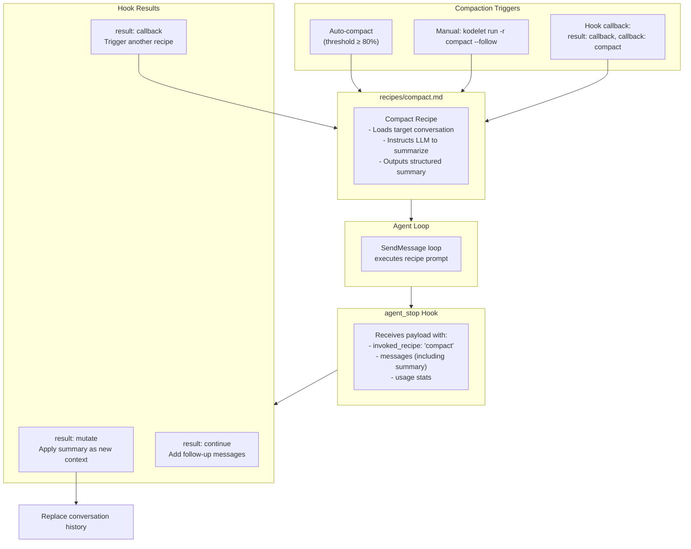
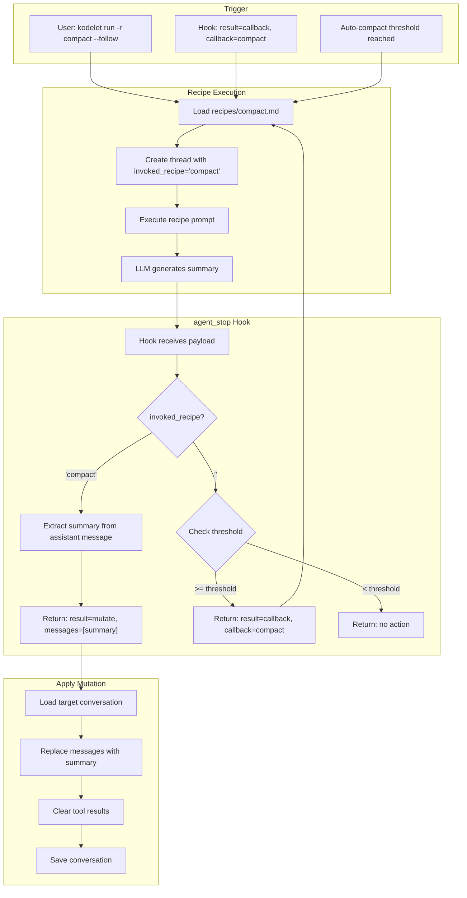
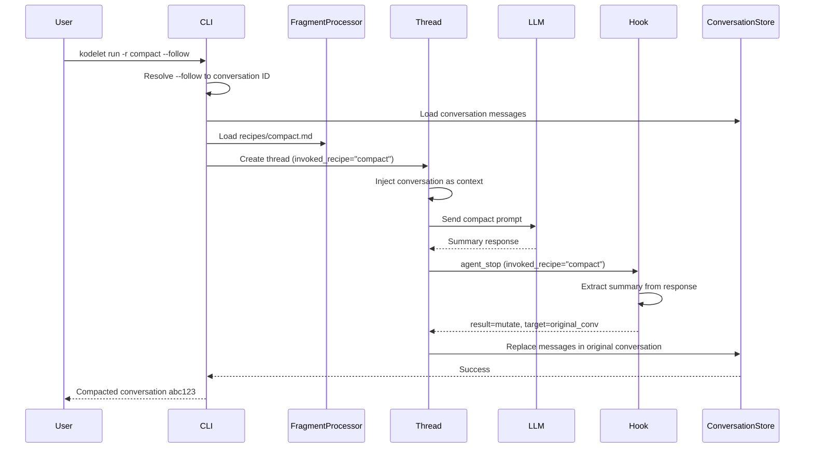
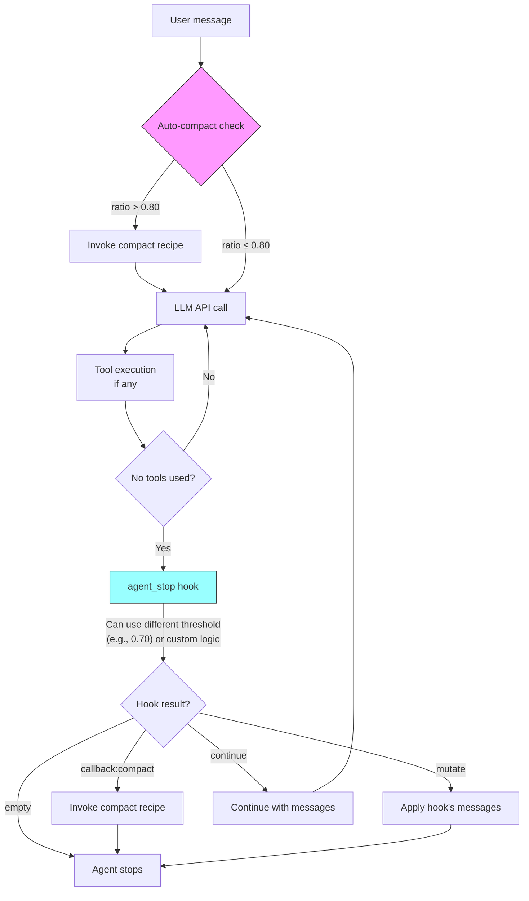

# ADR 025: Enhanced Hook System with Runtime Protocol and Message Mutation

## Status
Implemented (Phases 1-4)

## Context

Kodelet's Agent Lifecycle Hooks system (ADR 021) provides extensibility through external executables that can observe and intercept agent behavior. The current implementation has served well for audit logging, security guardrails, and basic agent control, but has limitations that prevent more sophisticated use cases.

### Current Limitations

1. **Binary-Only Protocol**: Hooks must be executable files that implement the `hook`/`run` protocol. This requires:
   - Users to write and compile standalone programs
   - Managing external dependencies for each hook
   - No access to Kodelet's internal services (LLM, storage, etc.)

2. **No Message Mutation on `agent_stop`**: The `agent_stop` hook can only inject follow-up messages, not modify or replace the existing conversation history. This prevents use cases like:
   - Context compaction triggered by hooks
   - Conversation summarization
   - Message filtering or redaction

3. **No LLM Access in Hooks**: Hooks that need AI capabilities (e.g., intelligent summarization) cannot access Kodelet's LLM infrastructure without making their own API calls.

### Motivating Use Case: Context Compaction

Context compaction currently runs automatically when the context window reaches a configurable threshold (default 80%). The implementation:
- Lives inside each LLM provider (`CompactContext()` method)
- Creates a temporary thread to generate a structured summary
- Replaces the entire conversation with the compacted summary
- Clears stale tool results and resets file access timestamps

**Problems with current approach:**

1. **No Manual Trigger**: Users cannot manually compact context when desired
2. **Provider Coupling**: Compaction logic is duplicated across Anthropic, OpenAI, and Google providers
3. **No Hook Integration**: Cannot be triggered by external events or conditions
4. **Inflexible Timing**: Only triggers on context threshold, not on other conditions (e.g., after specific operations)

**Desired State:**

1. Manual compaction via `kodelet run -r compact --follow`
2. Hook-triggered compaction (e.g., on `agent_stop` when certain conditions are met)
3. Recipe-based compaction logic (single source of truth)
4. Hook awareness of invoked recipe to coordinate behavior

### Goals

1. **Recipe-Based Operations**: Complex operations like compaction are defined as recipes, invokable manually or via callbacks
2. **Message Mutation Support**: Enable `agent_stop` hooks to replace/modify conversation history
3. **Recipe-Aware Hooks**: Hooks receive context about which recipe invoked the session
4. **Callback System**: Hooks can request recipe execution via callbacks
5. **Runtime Hook Protocol**: Support for Go-based hooks with access to Kodelet services (future phase)

## Decision

Introduce an **Enhanced Hook System** with recipe integration:

1. **Compact Recipe**: The compaction prompt lives as a recipe (`recipes/compact.md`)
2. **Recipe-Aware Hooks**: Hook payloads include `invoked_recipe` field
3. **Callback System**: Callbacks invoke recipes and return results for mutation
4. **Message Mutation**: Hooks can directly mutate conversation history

### Architecture Overview



## Detailed Design

### 1. Compact Recipe

The compaction logic is defined as a recipe, providing a single source of truth:

```markdown
<!-- recipes/compact.md -->
---
name: compact
description: Compact conversation context into a structured summary
allowed_tools: []
---
You are a conversation summarizer. Analyze the conversation history and produce 
a structured summary that preserves essential context for continuing the work.

## Output Format

Produce a summary with these sections:

1. **Primary Objective**: What is the user trying to accomplish? Current status?
2. **Key Decisions**: Important technical or design decisions made
3. **Files Modified**: List of files examined, created, or modified with brief descriptions
4. **Errors & Resolutions**: Any errors encountered and how they were resolved
5. **Pending Tasks**: What remains to be done?

## Rules

- Be concise but complete - this summary replaces the full conversation
- Preserve specific details like file paths, function names, error messages
- Focus on actionable information needed to continue the work
- Output ONLY the summary, no preamble or explanation

## Conversation to Summarize

The conversation history is provided in the context above.
```


### 2. Recipe-Aware Hook Payload

The `agent_stop` payload includes recipe context so hooks can coordinate behavior:

```go
// pkg/hooks/payload.go

// AgentStopPayload is sent to agent_stop hooks
type AgentStopPayload struct {
    BasePayload
    Messages []llmtypes.Message `json:"messages"`
    Usage    UsageInfo          `json:"usage"`
    
    // InvokedRecipe is the recipe that triggered this agent session (if any)
    // Empty string if no recipe was used (e.g., direct query)
    InvokedRecipe string `json:"invoked_recipe,omitempty"`
    
    // AutoCompactEnabled indicates if auto-compact is enabled for this session
    AutoCompactEnabled bool `json:"auto_compact_enabled"`
    
    // AutoCompactThreshold is the threshold ratio (e.g., 0.80)
    AutoCompactThreshold float64 `json:"auto_compact_threshold,omitempty"`
}

// UsageInfo provides token usage statistics
type UsageInfo struct {
    InputTokens          int `json:"input_tokens"`
    OutputTokens         int `json:"output_tokens"`
    CurrentContextWindow int `json:"current_context_window"`
    MaxContextWindow     int `json:"max_context_window"`
}
```

#### Example Payload (compact recipe invoked)

```json
{
  "event": "agent_stop",
  "conv_id": "abc123",
  "cwd": "/home/user/project",
  "invoked_recipe": "compact",
  "auto_compact_enabled": true,
  "auto_compact_threshold": 0.80,
  "messages": [
    {"role": "user", "content": "You are a conversation summarizer..."},
    {"role": "assistant", "content": "## Summary\n\n### Primary Objective\n..."}
  ],
  "usage": {
    "current_context_window": 2000,
    "max_context_window": 128000
  },
  "invoked_by": "main"
}
```

#### Example Payload (regular session, no recipe)

```json
{
  "event": "agent_stop",
  "conv_id": "abc123",
  "cwd": "/home/user/project",
  "invoked_recipe": "",
  "auto_compact_enabled": true,
  "auto_compact_threshold": 0.80,
  "messages": [
    {"role": "user", "content": "Fix the bug in auth.go"},
    {"role": "assistant", "content": "I've fixed the bug..."}
  ],
  "usage": {
    "current_context_window": 95000,
    "max_context_window": 128000
  },
  "invoked_by": "main"
}
```

### 3. Hook Results

```go
// pkg/hooks/payload.go

// HookResult represents the outcome of an agent_stop hook
type HookResult string

const (
    HookResultNone     HookResult = ""         // No action, agent stops normally
    HookResultContinue HookResult = "continue" // Continue with follow-up messages
    HookResultMutate   HookResult = "mutate"   // Replace conversation messages
    HookResultCallback HookResult = "callback" // Invoke a recipe via callback
)

// AgentStopResult is returned by agent_stop hooks
type AgentStopResult struct {
    // Result specifies the outcome of the hook
    Result HookResult `json:"result,omitempty"`

    // Messages has different meanings based on Result:
    // - Result="continue": Follow-up messages to append (agent continues processing)
    // - Result="mutate": Replacement messages for the entire conversation history
    Messages []llmtypes.Message `json:"messages,omitempty"`

    // Callback specifies which recipe to invoke via callback
    // Only used when Result="callback"
    Callback string `json:"callback,omitempty"`

    // CallbackArgs provides arguments to pass to the recipe
    CallbackArgs map[string]string `json:"callback_args,omitempty"`
    
    // TargetConversationID specifies which conversation to apply mutations to
    // Defaults to current conversation if empty
    TargetConversationID string `json:"target_conversation_id,omitempty"`
}
```

#### Hook Response Examples

**When compact recipe finishes - apply summary as mutation:**
```json
{
  "result": "mutate",
  "messages": [
    {"role": "user", "content": "## Summary\n\n### Primary Objective\n..."}
  ],
  "target_conversation_id": "original-conv-123"
}
```

**When context threshold reached - trigger compact recipe:**
```json
{
  "result": "callback",
  "callback": "compact",
  "callback_args": {
    "target_conversation_id": "abc123"
  }
}
```

**Continue with follow-up messages:**
```json
{
  "result": "continue",
  "messages": [
    {"role": "user", "content": "Please also run the linter"}
  ]
}
```

**No action (agent stops normally):**
```json
{}
```

### 4. Callback Registry

Callbacks invoke recipes and return results for processing:

```go
// pkg/hooks/callbacks.go

// CallbackRegistry manages recipe-based callbacks
type CallbackRegistry struct {
    fragmentProcessor *fragments.Processor
    threadFactory     func(ctx context.Context, config llmtypes.Config) (llmtypes.Thread, error)
    config            llmtypes.Config
}

// NewCallbackRegistry creates a registry with access to recipes
func NewCallbackRegistry(
    fp *fragments.Processor,
    tf func(ctx context.Context, config llmtypes.Config) (llmtypes.Thread, error),
    config llmtypes.Config,
) *CallbackRegistry {
    return &CallbackRegistry{
        fragmentProcessor: fp,
        threadFactory:     tf,
        config:            config,
    }
}

// Execute invokes a recipe by name and returns the result
func (r *CallbackRegistry) Execute(ctx context.Context, recipeName string, args map[string]string) (*CallbackResult, error) {
    // Load the recipe
    fragment, err := r.fragmentProcessor.LoadFragment(ctx, &fragments.Config{
        FragmentName: recipeName,
        Arguments:    args,
    })
    if err != nil {
        return nil, errors.Wrapf(err, "failed to load recipe %s", recipeName)
    }
    
    // Create a thread to execute the recipe
    // Mark it with the recipe name so the hook knows the context
    config := r.config
    config.InvokedRecipe = recipeName
    
    thread, err := r.threadFactory(ctx, config)
    if err != nil {
        return nil, errors.Wrap(err, "failed to create thread for callback")
    }
    
    // Execute the recipe
    handler := &llmtypes.StringCollectorHandler{Silent: true}
    _, err = thread.SendMessage(ctx, fragment.Content, handler, llmtypes.MessageOpt{
        DisableAutoCompact: true,  // Prevent infinite loop
        NoSaveConversation: true,
    })
    if err != nil {
        return nil, errors.Wrap(err, "failed to execute recipe")
    }
    
    output := handler.CollectedText()
    
    return &CallbackResult{
        RecipeOutput: output,
        Messages: []llmtypes.Message{
            {Role: "user", Content: output},
        },
        Continue: false,
    }, nil
}

// CallbackResult contains the result of a callback execution
type CallbackResult struct {
    RecipeOutput string             `json:"recipe_output,omitempty"`
    Messages     []llmtypes.Message `json:"messages,omitempty"`
    Continue     bool               `json:"continue"`
}
```

### 5. Built-in Compact Hook

A built-in hook that coordinates the compact recipe flow:

```go
// pkg/hooks/builtin/compact.go

// CompactHook handles the compact recipe coordination
// This hook is automatically registered and handles two scenarios:
// 1. When compact recipe finishes: extract summary and apply as mutation
// 2. When context threshold reached: trigger compact recipe

func (h *CompactHook) Execute(payload *hooks.AgentStopPayload) (*hooks.AgentStopResult, error) {
    // Case 1: Compact recipe just finished - apply its output as mutation
    if payload.InvokedRecipe == "compact" {
        // Extract the assistant's summary from the last message
        var summary string
        for i := len(payload.Messages) - 1; i >= 0; i-- {
            if payload.Messages[i].Role == "assistant" {
                summary = payload.Messages[i].Content
                break
            }
        }
        
        if summary != "" {
            return &hooks.AgentStopResult{
                Result: hooks.HookResultMutate,
                Messages: []llmtypes.Message{
                    {Role: "user", Content: summary},
                },
                // Apply to the original conversation, not the compact session
                TargetConversationID: payload.CallbackArgs["target_conversation_id"],
            }, nil
        }
        return &hooks.AgentStopResult{}, nil
    }
    
    // Case 2: Regular session - check if auto-compact should trigger
    if payload.AutoCompactEnabled && payload.Usage.MaxContextWindow > 0 {
        ratio := float64(payload.Usage.CurrentContextWindow) / float64(payload.Usage.MaxContextWindow)
        if ratio >= payload.AutoCompactThreshold {
            return &hooks.AgentStopResult{
                Result:   hooks.HookResultCallback,
                Callback: "compact",
                CallbackArgs: map[string]string{
                    "target_conversation_id": payload.ConvID,
                },
            }, nil
        }
    }
    
    // No action needed
    return &hooks.AgentStopResult{}, nil
}
```

### 6. Provider Integration

Each LLM provider tracks recipe context and implements message mutation:

```go
// pkg/llm/anthropic/anthropic.go

type Thread struct {
    // ... existing fields ...
    
    invokedRecipe    string                  // Recipe that started this session
    callbackRegistry *hooks.CallbackRegistry // For executing recipe callbacks
}

// SetInvokedRecipe sets the recipe context for hook payloads
func (t *Thread) SetInvokedRecipe(recipe string) {
    t.invokedRecipe = recipe
}

// replaceMessages replaces the entire conversation history
func (t *Thread) replaceMessages(ctx context.Context, messages []llmtypes.Message) {
    t.Mu.Lock()
    defer t.Mu.Unlock()
    
    t.messages = make([]anthropic.MessageParam, 0, len(messages))
    for _, msg := range messages {
        t.messages = append(t.messages, anthropic.MessageParam{
            Role: anthropic.MessageParamRole(msg.Role),
            Content: []anthropic.ContentBlockParamUnion{
                anthropic.NewTextBlock(msg.Content),
            },
        })
    }
    
    t.ToolResults = make(map[string]tooltypes.StructuredToolResult)
    logger.G(ctx).WithField("message_count", len(messages)).Info("conversation messages replaced")
}

// processAgentStopHook processes the agent_stop hook with recipe context
func (t *Thread) processAgentStopHook(ctx context.Context) (bool, error) {
    messages, _ := t.GetMessages()
    usage := t.GetUsage()
    
    payload := hooks.AgentStopPayload{
        BasePayload: hooks.BasePayload{
            Event:     hooks.HookTypeAgentStop,
            ConvID:    t.conversationID,
            CWD:       t.cwd,
            InvokedBy: t.invokedBy(),
        },
        Messages:             messages,
        InvokedRecipe:        t.invokedRecipe,
        AutoCompactEnabled:   t.config.CompactRatio > 0,
        AutoCompactThreshold: t.config.CompactRatio,
        Usage: hooks.UsageInfo{
            InputTokens:          usage.InputTokens,
            OutputTokens:         usage.OutputTokens,
            CurrentContextWindow: usage.CurrentContextWindow,
            MaxContextWindow:     usage.MaxContextWindow,
        },
    }
    
    result, err := t.hookManager.ExecuteAgentStop(ctx, payload)
    if err != nil {
        return false, err
    }
    
    return t.processHookResult(ctx, result)
}

func (t *Thread) processHookResult(ctx context.Context, result *hooks.AgentStopResult) (bool, error) {
    switch result.Result {
    case hooks.HookResultCallback:
        logger.G(ctx).WithField("callback", result.Callback).Info("hook requested recipe callback")
        
        callbackResult, err := t.callbackRegistry.Execute(ctx, result.Callback, result.CallbackArgs)
        if err != nil {
            return false, errors.Wrapf(err, "callback %s failed", result.Callback)
        }
        
        // The callback executed a recipe, which will trigger its own agent_stop hook
        // That hook will handle applying the mutation
        return callbackResult.Continue, nil

    case hooks.HookResultMutate:
        logger.G(ctx).Info("hook requested message mutation")
        if len(result.Messages) > 0 {
            // Apply to target conversation if specified
            if result.TargetConversationID != "" && result.TargetConversationID != t.conversationID {
                return false, t.applyMutationToConversation(ctx, result.TargetConversationID, result.Messages)
            }
            t.replaceMessages(ctx, result.Messages)
        }
        return false, nil

    case hooks.HookResultContinue:
        if len(result.Messages) > 0 {
            for _, msg := range result.Messages {
                t.AddUserMessage(ctx, msg.Content)
            }
            return true, nil
        }
        return false, nil

    default:
        return false, nil
    }
}

// applyMutationToConversation applies a mutation to a different conversation
func (t *Thread) applyMutationToConversation(ctx context.Context, convID string, messages []llmtypes.Message) error {
    // Load the conversation from storage
    conv, err := t.conversationStore.Load(ctx, convID)
    if err != nil {
        return errors.Wrapf(err, "failed to load conversation %s", convID)
    }
    
    // Replace messages
    conv.Messages = messages
    conv.ToolResults = nil
    
    // Save back
    if err := t.conversationStore.Save(ctx, conv); err != nil {
        return errors.Wrapf(err, "failed to save conversation %s", convID)
    }
    
    logger.G(ctx).WithFields(logrus.Fields{
        "conversation_id": convID,
        "message_count":   len(messages),
    }).Info("applied mutation to conversation")
    
    return nil
}
```

### 7. Complete Flow Diagram



### 8. Manual Invocation Flow

When user runs `kodelet run -r compact --follow`:




### 9. Auto-Compact vs Hook-Triggered Compact

Auto-compact (threshold-based) runs *before* each LLM call, while hook-triggered compact runs *after* the agent stops. They can coexist:



**Timing summary:**
- **Auto-compact** (pink): Runs *before* LLM call, threshold-based safety net (default 80%)
- **Hook-triggered** (cyan): Runs *after* agent completes, supports callbacks or direct mutation

This allows users to:
- Keep auto-compact as a safety net (high threshold like 80%)
- Use hooks for proactive compaction (lower threshold like 70%)
- Implement custom logic (e.g., compact after specific operations, time-based, etc.)
- Perform direct message mutation without needing LLM access

## Implementation Phases

### Phase 1: Recipe and Hook Infrastructure ✅
- [x] Create `recipes/compact.md` with the summarization prompt
- [x] Add `InvokedRecipe` field to thread configuration
- [x] Extend `AgentStopPayload` with `invoked_recipe`, `auto_compact_enabled`, `auto_compact_threshold`
- [x] Add `HookResult` type with `continue`, `mutate`, `callback` values
- [x] Implement `CallbackRegistry` that invokes recipes via `FragmentProcessor`

### Phase 2: Message Mutation and Callbacks ✅
- [x] Implement `replaceMessages()` in all providers (Anthropic, OpenAI, Google)
- [x] Implement `applyMutationToConversation()` for cross-conversation mutations
- [x] Add `TargetConversationID` field to `AgentStopResult`
- [x] Implement `processHookResult()` with callback, mutate, continue handling
- [ ] Write integration tests for mutation scenarios (deferred)

### Phase 3: Built-in Compact Hook ✅
- [x] Implement `pkg/hooks/builtin/compact.go`
- [x] Register as default hook in hook manager
- [x] Handle compact recipe completion → mutation flow
- [x] Handle threshold detection → callback flow
- [x] Remove old `CompactContext()` from providers
- [x] Update documentation

### Phase 4: CLI Integration ✅
- [x] Update `kodelet run -r compact --follow` to work with new system
- [x] Ensure `--follow` correctly passes target conversation ID
- [x] Add user feedback for compaction operations
- [x] Update help text and MANUAL.md

### Future Phases
- [ ] Runtime hook protocol (Go plugins for hooks with service access)
- [ ] Add declarative hook configuration (YAML-based)
- [ ] Add hook composition (chaining multiple hooks with result merging)
- [ ] Support async callbacks for long-running operations

## Consequences

### Positive

- **Recipe-Based Compaction**: Single source of truth in `recipes/compact.md`, usable manually or via hooks
- **Manual Control**: Users can trigger compaction via `kodelet run -r compact --follow`
- **Hook Flexibility**: Hooks can either mutate messages directly or invoke recipe callbacks
- **Recipe-Aware Coordination**: Hooks know which recipe invoked the session via `invoked_recipe`
- **Clean API**: Simple result-based response format with clear semantics (`continue`, `mutate`, `callback`)
- **Better Observability**: Usage info and recipe context in payloads enable context-aware decisions
- **Decoupled Providers**: Remove `CompactContext()` from providers, compaction handled entirely through recipe + hook coordination

### Negative

- **Increased Complexity**: More moving parts (recipes, callbacks, result types, cross-conversation mutations)
- **Migration Effort**: Providers need updating to support `replaceMessages()` and callback registry
- **Documentation Burden**: New concepts (results, callbacks, mutation, recipe-aware hooks) to explain to users
- **Testing Surface**: More code paths to test (callback execution, message mutation, cross-conversation scenarios)

### Risks

1. **Result Conflicts**: Multiple hooks requesting conflicting results (e.g., one returns `mutate`, another returns `callback`)
   - *Mitigation*: First non-empty result wins, log conflicts

2. **Invalid Message Mutation**: Hooks providing malformed messages that break conversation state
   - *Mitigation*: Validate message structure before applying mutation

3. **Circular Callbacks**: Callback triggering another callback indefinitely
   - *Mitigation*: `DisableAutoCompact: true` flag prevents compact recipe from triggering its own compaction

4. **Cross-Conversation Mutation**: Wrong conversation ID could corrupt unrelated conversations
   - *Mitigation*: Validate conversation exists and is owned by current session before mutation

## Alternatives Considered

### 1. Action-Based Design (No Message Mutation)

Use `action: compact` instead of `result: callback` with separate mutation support.

**Pros**: Simpler response format
**Cons**: Hooks cannot perform their own summarization, must always use built-in callbacks

**Decision**: Rejected. The `result`-based design with both `mutate` and `callback` options provides more flexibility - hooks can either perform direct mutation or delegate to recipe-based callbacks.

### 2. CompactService (Hardcoded Service)

Create a dedicated `pkg/compact` service with the compaction prompt hardcoded in Go.

**Pros**: Simpler initial implementation
**Cons**: Duplicates pattern we already have in fragments/recipes, can't be customized by users

**Decision**: Rejected. Using the existing recipe system provides a single pattern for defining LLM prompts, and allows users to customize the compact prompt.

### 3. Embedded Scripting (JavaScript/Lua)

Use an embedded interpreter for runtime hooks instead of Go plugins.

**Pros**: Sandboxed, easier to write
**Cons**: Performance overhead, limited service access, another runtime to maintain

**Decision**: Deferred for future consideration. Binary hooks + recipe callbacks provide sufficient flexibility for now.

### 4. Webhook-Based Hooks

Make hooks HTTP endpoints instead of executables.

**Pros**: Language-agnostic, can run remotely
**Cons**: Requires running services, latency, complexity for simple use cases

**Decision**: Could be added as another protocol option but doesn't replace local hooks.

### 5. Compaction as Standalone CLI Command Only

Add `kodelet compact` command without hook integration.

**Pros**: Simpler implementation
**Cons**: Can't be triggered by hooks, no automatic compaction on threshold

**Decision**: Rejected. Recipe-based approach with hook coordination enables both manual and automatic invocation through a unified system.

## Example Usage

### Manual Compaction via Recipe

```bash
# Compact the most recent conversation using the compact recipe
kodelet run -r compact --follow

# Compact a specific conversation
kodelet run -r compact --follow --conversation-id abc123
```

### Hook-Triggered Compaction (Using Callback)

```bash
#!/bin/bash
# ~/.kodelet/hooks/smart_compact
# Uses the registered "compact" callback to invoke the compact recipe

case "$1" in
    hook)
        echo "agent_stop"
        ;;
    run)
        payload=$(cat)
        
        # Skip if this is the compact recipe finishing
        invoked_recipe=$(echo "$payload" | jq -r '.invoked_recipe // ""')
        if [ "$invoked_recipe" = "compact" ]; then
            exit 0
        fi
        
        current=$(echo "$payload" | jq '.usage.current_context_window')
        max=$(echo "$payload" | jq '.usage.max_context_window')
        conv_id=$(echo "$payload" | jq -r '.conv_id')

        # Invoke compact recipe if over 70% utilization
        ratio=$(echo "scale=2; $current / $max" | bc)
        if (( $(echo "$ratio > 0.70" | bc -l) )); then
            echo "{\"result\": \"callback\", \"callback\": \"compact\", \"callback_args\": {\"target_conversation_id\": \"$conv_id\"}}"
        fi
        ;;
esac
```

### Hook-Triggered Compaction (Direct Mutation)

```bash
#!/bin/bash
# ~/.kodelet/hooks/simple_compact
# Performs its own summarization without LLM access

case "$1" in
    hook)
        echo "agent_stop"
        ;;
    run)
        payload=$(cat)
        
        # Skip if this is the compact recipe finishing
        invoked_recipe=$(echo "$payload" | jq -r '.invoked_recipe // ""')
        if [ "$invoked_recipe" = "compact" ]; then
            exit 0
        fi
        
        current=$(echo "$payload" | jq '.usage.current_context_window')
        max=$(echo "$payload" | jq '.usage.max_context_window')

        # Direct message mutation if over 70% utilization
        ratio=$(echo "scale=2; $current / $max" | bc)
        if (( $(echo "$ratio > 0.70" | bc -l) )); then
            # Extract key info and create summary (simplified example)
            summary=$(echo "$payload" | jq -r '.messages | map(select(.role == "user")) | .[0].content')
            echo "{\"result\": \"mutate\", \"messages\": [{\"role\": \"user\", \"content\": \"Previous context summary: $summary\"}]}"
        fi
        ;;
esac
```

### Compact Recipe Completion Hook (Built-in)

```bash
#!/bin/bash
# This logic is built into kodelet but shown here for illustration
# When compact recipe finishes, apply its output as mutation to original conversation

case "$1" in
    hook)
        echo "agent_stop"
        ;;
    run)
        payload=$(cat)
        invoked_recipe=$(echo "$payload" | jq -r '.invoked_recipe // ""')
        
        # Only handle compact recipe completion
        if [ "$invoked_recipe" = "compact" ]; then
            # Extract summary from assistant's last message
            summary=$(echo "$payload" | jq -r '[.messages[] | select(.role == "assistant")] | last | .content')
            target_conv=$(echo "$payload" | jq -r '.callback_args.target_conversation_id // ""')
            
            if [ -n "$summary" ] && [ -n "$target_conv" ]; then
                echo "{\"result\": \"mutate\", \"messages\": [{\"role\": \"user\", \"content\": $summary}], \"target_conversation_id\": \"$target_conv\"}"
            fi
        fi
        ;;
esac
```

### Hook with Follow-up Messages

```bash
#!/bin/bash
# ~/.kodelet/hooks/lint_reminder
# Reminds the agent to run linting after code changes

case "$1" in
    hook)
        echo "agent_stop"
        ;;
    run)
        payload=$(cat)
        # Check if any file_edit or file_write tools were used
        has_edits=$(echo "$payload" | jq '[.messages[].content // "" | contains("file_edit") or contains("file_write")] | any')
        
        if [ "$has_edits" = "true" ]; then
            echo '{"result": "continue", "messages": [{"role": "user", "content": "Please run the linter to check for any issues."}]}'
        fi
        ;;
esac
```

### Registering Custom Recipe Callbacks

```go
// Register a custom recipe as a callback
// The recipe must exist in recipes/ directory or ~/.kodelet/recipes/
registry := hooks.NewCallbackRegistry(fragmentProcessor, threadFactory, config)

// Hook can invoke any recipe via:
// {"result": "callback", "callback": "my-custom-recipe", "callback_args": {"key": "value"}}

// For non-recipe callbacks, register a function:
registry.RegisterFunc("redact-pii", func(ctx context.Context, args map[string]string) (*hooks.CallbackResult, error) {
    // Custom logic that doesn't need LLM
    return &hooks.CallbackResult{
        Messages: redactedMessages,
        Continue: false,
    }, nil
})
```

## Related ADRs

- **ADR 021: Agent Lifecycle Hooks** - Original hook system design
- **ADR 006: Conversation Persistence** - Conversation storage that compaction affects
- **ADR 023: Unified Thread Base Package** - Base thread infrastructure used by CompactService
- **ADR 020: Agentic Skills** - Similar pattern for extending agent capabilities

## References

- [Hook system implementation](../pkg/hooks/)
- [Fragment/recipe system](../pkg/fragments/)
- [docs/HOOKS.md](../docs/HOOKS.md)
- [docs/FRAGMENTS.md](../docs/FRAGMENTS.md)
