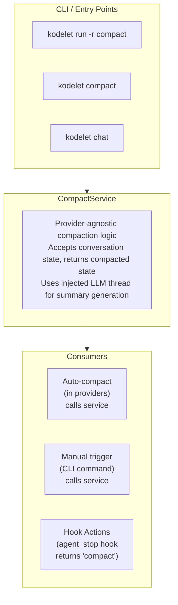
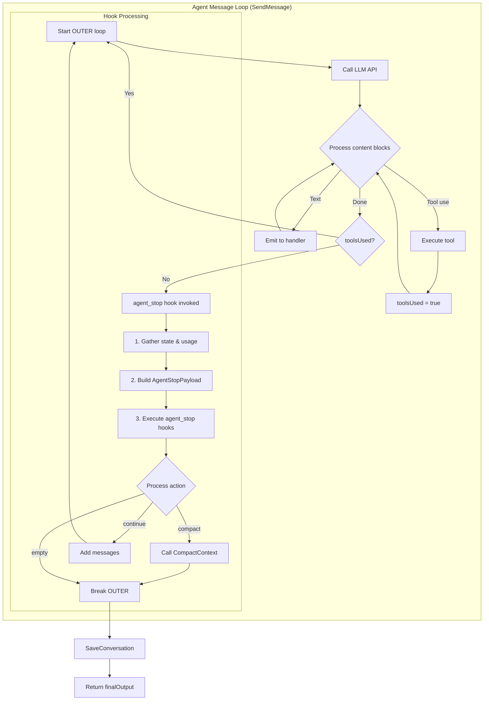
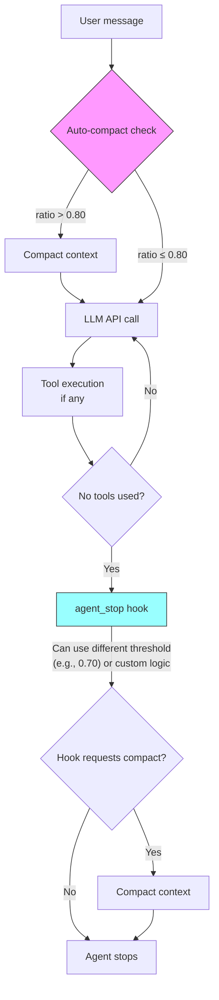

# ADR 025: Enhanced Hook System with Runtime Protocol and Message Mutation

## Status
Proposed

## Context

Kodelet's Agent Lifecycle Hooks system (ADR 021) provides extensibility through external executables that can observe and intercept agent behavior. The current implementation has served well for audit logging, security guardrails, and basic agent control, but has limitations that prevent more sophisticated use cases.

### Current Limitations

1. **Binary-Only Protocol**: Hooks must be executable files that implement the `hook`/`run` protocol. This requires:
   - Users to write and compile standalone programs
   - Managing external dependencies for each hook
   - No access to Kodelet's internal services (LLM, storage, etc.)

2. **No Message Mutation on `agent_stop`**: The `agent_stop` hook can only inject follow-up messages, not modify or replace the existing conversation history. This prevents use cases like:
   - Context compaction triggered by hooks
   - Conversation summarization
   - Message filtering or redaction

3. **No LLM Access in Hooks**: Hooks that need AI capabilities (e.g., intelligent summarization) cannot access Kodelet's LLM infrastructure without making their own API calls.

### Motivating Use Case: Context Compaction

Context compaction currently runs automatically when the context window reaches a configurable threshold (default 80%). The implementation:
- Lives inside each LLM provider (`CompactContext()` method)
- Creates a temporary thread to generate a structured summary
- Replaces the entire conversation with the compacted summary
- Clears stale tool results and resets file access timestamps

**Problems with current approach:**

1. **No Manual Trigger**: Users cannot manually compact context when desired
2. **Provider Coupling**: Compaction logic is duplicated across Anthropic, OpenAI, and Google providers
3. **No Hook Integration**: Cannot be triggered by external events or conditions
4. **Inflexible Timing**: Only triggers on context threshold, not on other conditions (e.g., after specific operations)

**Desired State:**

1. Manual compaction via `kodelet run -r compact` or `kodelet compact`
2. Hook-triggered compaction (e.g., on `agent_stop` when certain conditions are met)
3. Centralized compaction service usable from any context
4. Extensible to other message manipulation operations

### Goals

1. **Runtime Hook Protocol**: Allow hooks to be defined as Go plugins or embedded scripts that have access to Kodelet services
2. **Message Mutation Support**: Enable `agent_stop` hooks to replace/modify conversation history
3. **Declarative Actions**: Hooks can return action requests (e.g., "compact") instead of performing operations themselves
4. **Backward Compatibility**: Existing binary hooks continue to work unchanged
5. **Recipe Integration**: Expose compaction (and future operations) as recipes for manual invocation

## Decision

Introduce an **Enhanced Hook System** with three major additions:

1. **CompactService**: A standalone service for context compaction, callable from providers, CLI, and hooks
2. **Hook Actions**: Extended hook response format supporting declarative actions like `compact`
3. **Runtime Hook Protocol**: Support for Go-based hooks with access to Kodelet services (future phase)

### Architecture Overview



## Detailed Design

### 1. CompactService

A new service that encapsulates compaction logic, independent of LLM providers.

#### Interface

```go
// pkg/compact/service.go
package compact

import (
    "context"

    llmtypes "github.com/jingkaihe/kodelet/pkg/types/llm"
    tooltypes "github.com/jingkaihe/kodelet/pkg/types/tools"
)

// ConversationState represents the current state of a conversation
type ConversationState struct {
    Messages    []llmtypes.Message                      `json:"messages"`
    ToolResults map[string]tooltypes.StructuredToolResult `json:"tool_results,omitempty"`
    Usage       llmtypes.Usage                          `json:"usage,omitempty"`
}

// CompactedState represents the result of compaction
type CompactedState struct {
    Summary     string         `json:"summary"`
    Usage       llmtypes.Usage `json:"usage"`
}

// Service provides context compaction functionality
type Service struct {
    threadFactory func(ctx context.Context) (llmtypes.Thread, error)
}

// NewService creates a new compact service
func NewService(threadFactory func(ctx context.Context) (llmtypes.Thread, error)) *Service {
    return &Service{threadFactory: threadFactory}
}

// Compact generates a structured summary of the conversation
func (s *Service) Compact(ctx context.Context, state ConversationState) (*CompactedState, error) {
    // Create a temporary thread for summary generation
    thread, err := s.threadFactory(ctx)
    if err != nil {
        return nil, errors.Wrap(err, "failed to create summary thread")
    }

    // Build prompt with conversation context
    prompt := s.buildCompactPrompt(state)

    // Generate summary
    handler := &llmtypes.StringCollectorHandler{Silent: true}
    _, err = thread.SendMessage(ctx, prompt, handler, llmtypes.MessageOpt{
        NoToolUse:          true,
        DisableAutoCompact: true,
        DisableUsageLog:    true,
        NoSaveConversation: true,
    })
    if err != nil {
        return nil, errors.Wrap(err, "failed to generate summary")
    }

    return &CompactedState{
        Summary: handler.CollectedText(),
        Usage:   thread.GetUsage(),
    }, nil
}
```

#### Integration with Providers

Each LLM provider delegates to CompactService:

```go
// pkg/llm/anthropic/anthropic.go
func (t *Thread) CompactContext(ctx context.Context) error {
    // Get current state
    messages, _ := t.GetMessages()
    state := compact.ConversationState{
        Messages:    messages,
        ToolResults: t.ToolResults,
        Usage:       t.GetUsage(),
    }

    // Use compact service
    compacted, err := t.compactService.Compact(ctx, state)
    if err != nil {
        return errors.Wrap(err, "compaction failed")
    }

    // Apply compacted state
    t.Mu.Lock()
    defer t.Mu.Unlock()

    t.messages = []anthropic.MessageParam{{
        Role: anthropic.MessageParamRoleUser,
        Content: []anthropic.ContentBlockParamUnion{
            anthropic.NewTextBlock(compacted.Summary),
        },
    }}
    t.ToolResults = make(map[string]tooltypes.StructuredToolResult)

    return nil
}
```

### 2. Hook Actions

Extend the hook response format to support declarative actions.

#### Extended AgentStopResult

```go
// pkg/hooks/payload.go

// HookAction represents a declarative action that hooks can request
type HookAction string

const (
    HookActionNone     HookAction = ""
    HookActionCompact  HookAction = "compact"
    HookActionSummary  HookAction = "summary"
    HookActionContinue HookAction = "continue" // Existing follow_up behavior
)

// AgentStopResult is returned by agent_stop hooks
type AgentStopResult struct {
    // FollowUpMessages contains optional messages to append to the conversation.
    // If provided, these are added as user messages and the agent continues.
    // DEPRECATED: Use Action: "continue" with Messages instead
    FollowUpMessages []string `json:"follow_up_messages,omitempty"`

    // Action specifies a declarative action for the agent to perform
    // Supported actions: "compact", "summary", "continue"
    Action HookAction `json:"action,omitempty"`

    // Messages is used with Action: "continue" to provide follow-up messages
    Messages []string `json:"messages,omitempty"`

    // ReplaceMessages replaces the entire conversation history
    // Only valid when Action: "compact" or similar mutation actions
    ReplaceMessages []llmtypes.Message `json:"replace_messages,omitempty"`
}
```

#### Hook Payload Structure

```json
{
  "event": "agent_stop",
  "conv_id": "abc123",
  "cwd": "/home/user/project",
  "messages": [
    {"role": "user", "content": "..."},
    {"role": "assistant", "content": "..."}
  ],
  "usage": {
    "input_tokens": 5000,
    "output_tokens": 2000,
    "current_context_window": 7000,
    "max_context_window": 128000
  },
  "invoked_by": "main"
}
```

#### Hook Response Examples

**Request Compaction:**
```json
{
  "action": "compact"
}
```

**Continue with Messages (new format):**
```json
{
  "action": "continue",
  "messages": ["Please also run the linter"]
}
```

**Replace Messages (advanced):**
```json
{
  "action": "replace",
  "replace_messages": [
    {"role": "user", "content": "Compacted summary of conversation..."}
  ]
}
```

#### Compact Action Trigger Flow

The `action: compact` is triggered through the `agent_stop` hook, which fires when the agent completes a task without requiring further tool calls. Here's the complete flow:



**Step-by-step breakdown:**

1. **Agent completes work**: The LLM returns a response without any tool calls, indicating it has finished the task.

2. **Hook invocation point**: Before breaking out of the message loop, the provider invokes `agent_stop` hooks:
   ```go
   // In SendMessage loop, when !toolsUsed
   if !toolsUsed {
       shouldContinue, err := t.processAgentStopHook(ctx)
       if err != nil {
           return "", err
       }
       if shouldContinue {
           continue OUTER  // Hook requested continuation
       }
       break OUTER  // Normal exit
   }
   ```

3. **Payload construction**: The hook receives current conversation state including usage statistics:
   ```go
   payload := hooks.AgentStopPayload{
       BasePayload: hooks.BasePayload{
           Event:     hooks.HookTypeAgentStop,
           ConvID:    t.conversationID,
           CWD:       cwd,
           InvokedBy: t.invokedBy(),
       },
       Messages: messages,
       Usage: hooks.UsageInfo{
           InputTokens:          usage.InputTokens,
           OutputTokens:         usage.OutputTokens,
           CurrentContextWindow: usage.CurrentContextWindow,
           MaxContextWindow:     usage.MaxContextWindow,
       },
   }
   ```

4. **Hook execution**: Binary hooks receive JSON via stdin, evaluate conditions, return action:
   ```bash
   # Hook receives:
   {"event":"agent_stop","messages":[...],"usage":{"current_context_window":95000,"max_context_window":128000}}
   
   # Hook logic: 95000/128000 = 74% > 70% threshold
   
   # Hook returns:
   {"action":"compact"}
   ```

5. **Action processing**: Provider receives the action and delegates to CompactService:
   ```go
   switch result.Action {
   case hooks.HookActionCompact:
       // CompactService generates summary via separate LLM call
       // Replaces conversation history with summary
       // Clears tool results cache
       if err := t.CompactContext(ctx); err != nil {
           return false, err
       }
       return false, nil  // Stop after compaction
   }
   ```

6. **Persistence**: After the loop exits, `SaveConversation()` persists the compacted state to SQLite.

**Key timing considerations:**

| Scenario | When agent_stop fires | Compaction behavior |
|----------|----------------------|---------------------|
| Single-turn `kodelet run "query"` | After final response | Compacts if hook requests, saves compacted state |
| Multi-turn `kodelet chat` | After each assistant turn with no tools | Can compact between turns, conversation continues with compacted context |
| `--follow` resume | After resumed conversation completes | Compacts accumulated context from previous + current session |

**Interaction with auto-compact:**

Auto-compact (threshold-based) runs *before* each LLM call, while hook-triggered compact runs *after* the agent stops. They can coexist:



**Timing summary:**
- **Auto-compact** (pink): Runs *before* LLM call, threshold-based safety net (default 80%)
- **Hook-triggered** (cyan): Runs *after* agent completes, supports custom logic

This allows users to:
- Keep auto-compact as a safety net (high threshold like 80%)
- Use hooks for proactive compaction (lower threshold like 70%)
- Implement custom logic (e.g., compact after specific operations, time-based, etc.)

#### Processing Hook Actions

```go
// pkg/llm/anthropic/anthropic.go (and other providers)

func (t *Thread) processAgentStopHook(ctx context.Context) (bool, error) {
    messages, _ := t.GetMessages()
    result := t.triggerAgentStop(ctx, messages)

    switch result.Action {
    case hooks.HookActionCompact:
        logger.G(ctx).Info("agent_stop hook requested compaction")
        if err := t.CompactContext(ctx); err != nil {
            return false, errors.Wrap(err, "hook-requested compaction failed")
        }
        return false, nil // Stop after compaction

    case hooks.HookActionContinue:
        msgs := result.Messages
        if len(msgs) == 0 {
            msgs = result.FollowUpMessages // Backward compatibility
        }
        if len(msgs) > 0 {
            for _, msg := range msgs {
                t.AddUserMessage(ctx, msg)
            }
            return true, nil // Continue processing
        }
        return false, nil

    case hooks.HookActionReplace:
        // Future: Direct message replacement
        // Requires careful validation and persistence sync
        return false, nil

    default:
        // Legacy behavior: check FollowUpMessages
        if len(result.FollowUpMessages) > 0 {
            for _, msg := range result.FollowUpMessages {
                t.AddUserMessage(ctx, msg)
            }
            return true, nil
        }
        return false, nil
    }
}
```

### 3. Compact Recipe

A recipe that exposes compaction for manual invocation.

#### Recipe Definition

```markdown
---
name: compact
description: Compact the current conversation context to reduce token usage
allowed_tools: []
---
# Context Compaction

You are being asked to compact the current conversation context. This operation:
1. Summarizes all previous messages into a structured format
2. Preserves key information: objectives, file changes, errors, and pending tasks
3. Replaces the conversation history with the compacted summary

The compaction is performed automatically by the system after this message.

{{if .conversation_id}}
Compacting conversation: {{.conversation_id}}
{{end}}
```

#### CLI Integration

```go
// cmd/kodelet/compact.go
package main

import (
    "github.com/spf13/cobra"
    "github.com/jingkaihe/kodelet/pkg/compact"
)

var compactCmd = &cobra.Command{
    Use:   "compact",
    Short: "Compact conversation context to reduce token usage",
    Long: `Compact the current or specified conversation by generating a structured
summary and replacing the message history. This reduces token usage while
preserving essential context.`,
    RunE: func(cmd *cobra.Command, args []string) error {
        convID, _ := cmd.Flags().GetString("conversation-id")
        follow, _ := cmd.Flags().GetBool("follow")

        if follow {
            convID = getLatestConversationID()
        }

        if convID == "" {
            return errors.New("conversation ID required (use --conversation-id or --follow)")
        }

        return runCompact(cmd.Context(), convID)
    },
}

func init() {
    rootCmd.AddCommand(compactCmd)
    compactCmd.Flags().StringP("conversation-id", "c", "", "Conversation ID to compact")
    compactCmd.Flags().Bool("follow", false, "Compact the most recent conversation")
}

func runCompact(ctx context.Context, convID string) error {
    // Load conversation
    conv, err := loadConversation(ctx, convID)
    if err != nil {
        return errors.Wrap(err, "failed to load conversation")
    }

    // Create compact service
    service := compact.NewService(createThreadFactory(ctx))

    // Perform compaction
    state := compact.ConversationState{
        Messages:    conv.Messages,
        ToolResults: conv.ToolResults,
    }

    compacted, err := service.Compact(ctx, state)
    if err != nil {
        return errors.Wrap(err, "compaction failed")
    }

    // Update conversation
    conv.Messages = []llmtypes.Message{
        {Role: "user", Content: compacted.Summary},
    }
    conv.ToolResults = nil

    // Save
    if err := saveConversation(ctx, conv); err != nil {
        return errors.Wrap(err, "failed to save compacted conversation")
    }

    presenter.Success("Compacted conversation %s", convID)
    presenter.Info("Reduced from %d messages to 1 summary message", len(state.Messages))

    return nil
}
```

### 4. Runtime Hook Protocol (Future Phase)

A future enhancement to support Go-based hooks with service access.

#### Protocol Overview

```go
// pkg/hooks/runtime/runtime.go
package runtime

import (
    "context"

    "github.com/jingkaihe/kodelet/pkg/compact"
    "github.com/jingkaihe/kodelet/pkg/hooks"
    llmtypes "github.com/jingkaihe/kodelet/pkg/types/llm"
)

// RuntimeHook is the interface for Go-based hooks
type RuntimeHook interface {
    // Type returns the hook type
    Type() hooks.HookType

    // Name returns the hook name for identification
    Name() string

    // Execute runs the hook with access to services
    Execute(ctx context.Context, payload interface{}, services *Services) (interface{}, error)
}

// Services provides access to Kodelet infrastructure
type Services struct {
    Compact       *compact.Service
    ThreadFactory func(ctx context.Context) (llmtypes.Thread, error)
    Store         conversations.Store
}

// Registry manages runtime hooks
type Registry struct {
    hooks    map[hooks.HookType][]RuntimeHook
    services *Services
}

// Register adds a runtime hook
func (r *Registry) Register(hook RuntimeHook) {
    r.hooks[hook.Type()] = append(r.hooks[hook.Type()], hook)
}
```

#### Example Runtime Hook

```go
// ~/.kodelet/hooks/auto_compact.go (hypothetical)
package main

import (
    "context"

    "github.com/jingkaihe/kodelet/pkg/hooks"
    "github.com/jingkaihe/kodelet/pkg/hooks/runtime"
)

type AutoCompactHook struct{}

func (h *AutoCompactHook) Type() hooks.HookType {
    return hooks.HookTypeAgentStop
}

func (h *AutoCompactHook) Name() string {
    return "auto_compact"
}

func (h *AutoCompactHook) Execute(ctx context.Context, payload interface{}, services *runtime.Services) (interface{}, error) {
    p := payload.(*hooks.AgentStopPayload)

    // Check if compaction is needed based on custom logic
    if float64(p.Usage.CurrentContextWindow)/float64(p.Usage.MaxContextWindow) > 0.7 {
        // Use compact service directly
        state := compact.ConversationState{Messages: p.Messages}
        compacted, err := services.Compact.Compact(ctx, state)
        if err != nil {
            return nil, err
        }

        return &hooks.AgentStopResult{
            Action: hooks.HookActionReplace,
            ReplaceMessages: []llmtypes.Message{
                {Role: "user", Content: compacted.Summary},
            },
        }, nil
    }

    return &hooks.AgentStopResult{}, nil
}
```

#### Discovery and Loading

Runtime hooks would be discovered similarly to binary hooks but with a different file extension or marker:

```
~/.kodelet/hooks/
├── audit_logger           # Binary hook (existing)
├── security_guardrail     # Binary hook (existing)
├── auto_compact.so        # Runtime hook (Go plugin) - future
└── smart_compact.yaml     # Declarative hook configuration - future
```

### 5. Hook Payload Enhancement

Add usage information to `agent_stop` payload for informed decision-making:

```go
// pkg/hooks/payload.go

// AgentStopPayload is sent to agent_stop hooks
type AgentStopPayload struct {
    BasePayload
    Messages []llmtypes.Message `json:"messages"`

    // NEW: Usage information for context-aware decisions
    Usage UsageInfo `json:"usage"`
}

// UsageInfo provides token usage statistics
type UsageInfo struct {
    InputTokens          int `json:"input_tokens"`
    OutputTokens         int `json:"output_tokens"`
    CurrentContextWindow int `json:"current_context_window"`
    MaxContextWindow     int `json:"max_context_window"`
}
```

## Implementation Phases

### Phase 1: CompactService Extraction (Week 1)
- [ ] Create `pkg/compact/` package with `Service` interface
- [ ] Extract compaction prompt logic from providers
- [ ] Implement `Compact()` method with thread factory injection
- [ ] Update Anthropic, OpenAI, and Google providers to use service
- [ ] Write unit tests for CompactService

### Phase 2: Hook Actions (Week 1-2)
- [ ] Add `HookAction` type and constants
- [ ] Extend `AgentStopResult` with `Action` field
- [ ] Add `Usage` to `AgentStopPayload`
- [ ] Implement action processing in all providers
- [ ] Update hook documentation
- [ ] Write integration tests

### Phase 3: CLI and Recipe (Week 2)
- [ ] Add `kodelet compact` command
- [ ] Create `compact.md` recipe
- [ ] Add `--conversation-id` and `--follow` flags
- [ ] Update help text and documentation

### Phase 4: Runtime Protocol Design (Week 3, Design Only)
- [ ] Design runtime hook interface
- [ ] Design service injection pattern
- [ ] Document security considerations
- [ ] Create proposal for Go plugin vs embedded scripting

### Future Phases
- [ ] Implement runtime hook loading (Go plugins or Yaegi)
- [ ] Add declarative hook configuration (YAML-based)
- [ ] Support message replacement in hooks
- [ ] Add hook composition (chaining multiple hooks)

## Consequences

### Positive

- **Centralized Compaction**: Single implementation usable from any context
- **Manual Control**: Users can trigger compaction when needed
- **Hook Flexibility**: Hooks can request intelligent actions without implementing them
- **Backward Compatible**: Existing hooks continue to work unchanged
- **Extensible Actions**: Easy to add new actions (summary, filter, etc.)
- **Better Observability**: Usage info in payloads enables smarter hook decisions

### Negative

- **Increased Complexity**: More moving parts (service, actions, protocols)
- **Migration Effort**: Providers need updating to use CompactService
- **Documentation Burden**: New concepts to explain to users
- **Testing Surface**: More code paths to test

### Risks

1. **Action Conflicts**: Multiple hooks requesting conflicting actions
   - *Mitigation*: First action wins, log conflicts

2. **Performance Impact**: Service call overhead vs inline implementation
   - *Mitigation*: Benchmark and optimize hot paths

3. **Runtime Hook Security**: Go plugins could have security implications
   - *Mitigation*: Design review before implementation, consider sandboxing

## Alternatives Considered

### 1. Message Mutation Only (No Actions)

Allow hooks to directly return modified messages instead of using declarative actions.

**Pros**: Simpler mental model, more flexible
**Cons**: Hooks must implement compaction logic themselves, no service access

**Decision**: Rejected because it doesn't solve the "hooks need LLM access" problem.

### 2. Embedded Scripting (JavaScript/Lua)

Use an embedded interpreter for runtime hooks instead of Go plugins.

**Pros**: Sandboxed, easier to write
**Cons**: Performance overhead, limited service access, another runtime to maintain

**Decision**: Deferred for future consideration. Go plugins provide better service integration.

### 3. Webhook-Based Hooks

Make hooks HTTP endpoints instead of executables.

**Pros**: Language-agnostic, can run remotely
**Cons**: Requires running services, latency, complexity for simple use cases

**Decision**: Could be added as another protocol option but doesn't replace local hooks.

### 4. Compaction as Built-in Command Only

Skip the service abstraction and just add a CLI command.

**Pros**: Simpler implementation
**Cons**: Can't be triggered by hooks, duplicates logic with auto-compact

**Decision**: Rejected because it doesn't address hook-triggered compaction.

## Example Usage

### Manual Compaction

```bash
# Compact the most recent conversation
kodelet compact --follow

# Compact a specific conversation
kodelet compact --conversation-id abc123

# Using recipe
kodelet run -r compact --follow
```

### Hook-Triggered Compaction

```bash
#!/bin/bash
# ~/.kodelet/hooks/smart_compact

case "$1" in
    hook)
        echo "agent_stop"
        ;;
    run)
        payload=$(cat)
        current=$(echo "$payload" | jq '.usage.current_context_window')
        max=$(echo "$payload" | jq '.usage.max_context_window')

        # Compact if over 70% utilization
        ratio=$(echo "scale=2; $current / $max" | bc)
        if (( $(echo "$ratio > 0.70" | bc -l) )); then
            echo '{"action": "compact"}'
        fi
        ;;
esac
```

### Programmatic Compaction

```go
// In application code
service := compact.NewService(threadFactory)
state := compact.ConversationState{
    Messages: conversation.Messages,
}
compacted, err := service.Compact(ctx, state)
if err != nil {
    return err
}
// Use compacted.Summary
```

## Related ADRs

- **ADR 021: Agent Lifecycle Hooks** - Original hook system design
- **ADR 006: Conversation Persistence** - Conversation storage that compaction affects
- **ADR 023: Unified Thread Base Package** - Base thread infrastructure used by CompactService
- **ADR 020: Agentic Skills** - Similar pattern for extending agent capabilities

## References

- [Current CompactContext implementation](../pkg/llm/anthropic/anthropic.go)
- [Hook system implementation](../pkg/hooks/)
- [Compact prompt](../pkg/llm/prompts/prompts.go)
- [docs/HOOKS.md](../docs/HOOKS.md)
