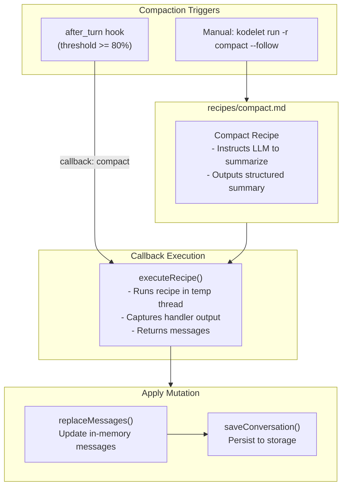
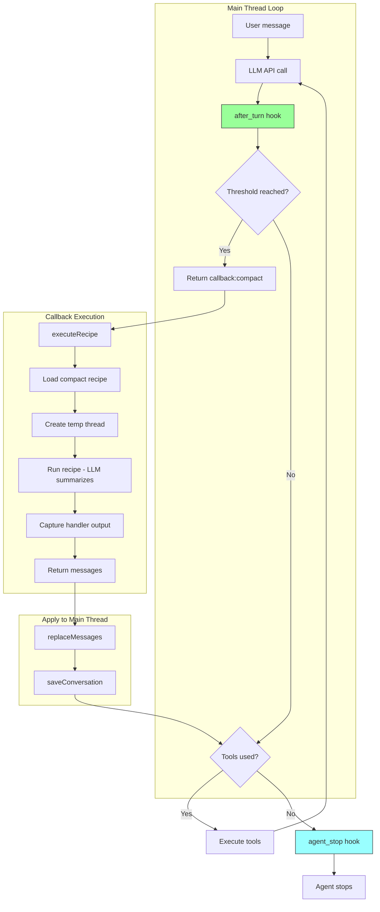
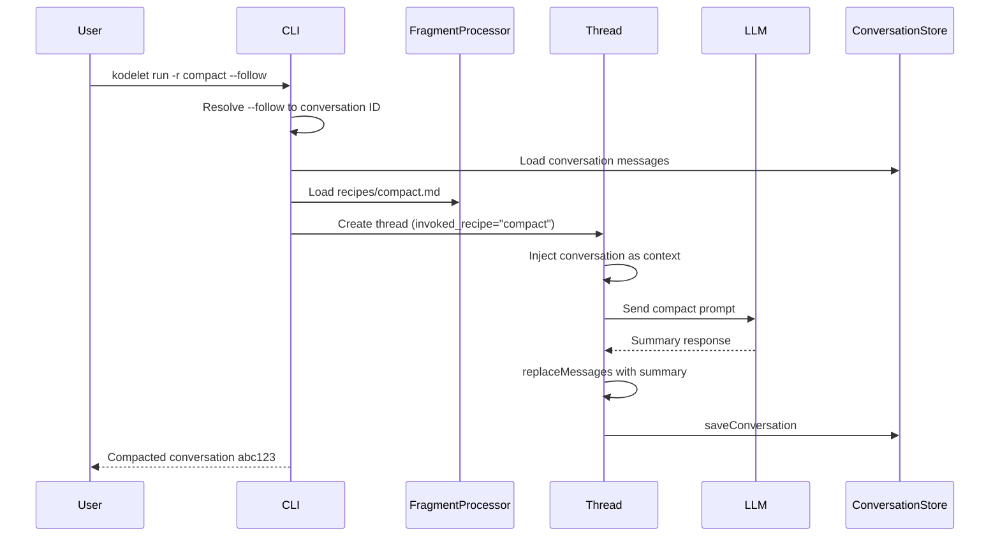

# ADR 025: Enhanced Hook System with Runtime Protocol and Message Mutation

## Status
Implemented (Simplified)

## Context

Kodelet's Agent Lifecycle Hooks system (ADR 021) provides extensibility through external executables that can observe and intercept agent behavior. The current implementation has served well for audit logging, security guardrails, and basic agent control, but has limitations that prevent more sophisticated use cases.

### Current Limitations

1. **Binary-Only Protocol**: Hooks must be executable files that implement the `hook`/`run` protocol. This requires:
   - Users to write and compile standalone programs
   - Managing external dependencies for each hook
   - No access to Kodelet's internal services (LLM, storage, etc.)

2. **No Message Mutation on `agent_stop`**: The `agent_stop` hook can only inject follow-up messages, not modify or replace the existing conversation history. This prevents use cases like:
   - Context compaction triggered by hooks
   - Conversation summarization
   - Message filtering or redaction

3. **No LLM Access in Hooks**: Hooks that need AI capabilities (e.g., intelligent summarization) cannot access Kodelet's LLM infrastructure without making their own API calls.

### Motivating Use Case: Context Compaction

Context compaction currently runs automatically when the context window reaches a configurable threshold (default 80%). The implementation:
- Lives inside each LLM provider (`CompactContext()` method)
- Creates a temporary thread to generate a structured summary
- Replaces the entire conversation with the compacted summary
- Clears stale tool results and resets file access timestamps

**Problems with current approach:**

1. **No Manual Trigger**: Users cannot manually compact context when desired
2. **Provider Coupling**: Compaction logic is duplicated across Anthropic, OpenAI, and Google providers
3. **No Hook Integration**: Cannot be triggered by external events or conditions
4. **Inflexible Timing**: Only triggers on context threshold, not on other conditions (e.g., after specific operations)

**Desired State:**

1. Manual compaction via `kodelet run -r compact --follow`
2. Hook-triggered compaction (e.g., on `after_turn` when threshold is reached)
3. Recipe-based compaction logic (single source of truth)
4. Hook awareness of invoked recipe to coordinate behavior

### Goals

1. **Recipe-Based Operations**: Complex operations like compaction are defined as recipes, invokable manually or via callbacks
2. **Message Mutation Support**: Enable hooks to replace/modify conversation history
3. **Recipe-Aware Hooks**: Hooks receive context about which recipe invoked the session
4. **Callback System**: Hooks can request recipe execution via callbacks
5. **Runtime Hook Protocol**: Support for Go-based hooks with access to Kodelet services (future phase)

## Decision

Introduce an **Enhanced Hook System** with recipe integration:

1. **Compact Recipe**: The compaction prompt lives as a recipe (`recipes/compact.md`)
2. **Recipe-Aware Hooks**: Hook payloads include `invoked_recipe` field
3. **Callback System**: Callbacks invoke recipes and return results for mutation
4. **Message Mutation**: Hooks can directly mutate conversation history

### Architecture Overview



## Detailed Design

### 1. Compact Recipe

The compaction logic is defined as a recipe, providing a single source of truth:

```markdown
<!-- recipes/compact.md -->
---
name: compact
description: Compact conversation context into a structured summary
allowed_tools: []
---
You are a conversation summarizer. Analyze the conversation history and produce
a structured summary that preserves essential context for continuing the work.

## Output Format

Produce a summary with these sections:

1. **Primary Objective**: What is the user trying to accomplish? Current status?
2. **Key Decisions**: Important technical or design decisions made
3. **Files Modified**: List of files examined, created, or modified with brief descriptions
4. **Errors & Resolutions**: Any errors encountered and how they were resolved
5. **Pending Tasks**: What remains to be done?

## Rules

- Be concise but complete - this summary replaces the full conversation
- Preserve specific details like file paths, function names, error messages
- Focus on actionable information needed to continue the work
- Output ONLY the summary, no preamble or explanation

## Conversation to Summarize

The conversation history is provided in the context above.
```


### 2. Recipe-Aware Hook Payload

The `agent_stop` payload includes recipe context so hooks can coordinate behavior:

```go
// pkg/hooks/payload.go

// AgentStopPayload is sent to agent_stop hooks
type AgentStopPayload struct {
    BasePayload
    Messages []llmtypes.Message `json:"messages"`
    Usage    UsageInfo          `json:"usage"`

    // InvokedRecipe is the recipe that triggered this agent session (if any)
    // Empty string if no recipe was used (e.g., direct query)
    InvokedRecipe string `json:"invoked_recipe,omitempty"`

    // AutoCompactEnabled indicates if auto-compact is enabled for this session
    AutoCompactEnabled bool `json:"auto_compact_enabled"`

    // AutoCompactThreshold is the threshold ratio (e.g., 0.80)
    AutoCompactThreshold float64 `json:"auto_compact_threshold,omitempty"`
}

// UsageInfo provides token usage statistics
type UsageInfo struct {
    InputTokens          int `json:"input_tokens"`
    OutputTokens         int `json:"output_tokens"`
    CurrentContextWindow int `json:"current_context_window"`
    MaxContextWindow     int `json:"max_context_window"`
}
```

### 3. Hook Results

```go
// pkg/hooks/payload.go

// HookResult represents the outcome of a hook
type HookResult string

const (
    HookResultNone     HookResult = ""         // No action, agent stops normally
    HookResultContinue HookResult = "continue" // Continue with follow-up messages
    HookResultMutate   HookResult = "mutate"   // Replace conversation messages
    HookResultCallback HookResult = "callback" // Invoke a recipe via callback
)

// AgentStopResult is returned by agent_stop hooks
type AgentStopResult struct {
    // Result specifies the outcome of the hook
    Result HookResult `json:"result,omitempty"`

    // FollowUpMessages for backward compatibility
    FollowUpMessages []string `json:"follow_up_messages,omitempty"`

    // Messages for mutation (when Result="mutate")
    // Or after callback execution (when Result="callback")
    Messages []llmtypes.Message `json:"messages,omitempty"`

    // Callback specifies which recipe to invoke via callback
    // Only used when Result="callback"
    Callback string `json:"callback,omitempty"`

    // CallbackArgs provides arguments to pass to the recipe (used as template vars)
    CallbackArgs map[string]string `json:"callback_args,omitempty"`
}

// AfterTurnResult is returned by after_turn hooks
type AfterTurnResult struct {
    Result       HookResult         `json:"result,omitempty"`
    Messages     []llmtypes.Message `json:"messages,omitempty"`
    Callback     string             `json:"callback,omitempty"`
    CallbackArgs map[string]string  `json:"callback_args,omitempty"`
}
```

#### Hook Response Examples

**Trigger compact recipe (from after_turn):**
```json
{
  "result": "callback",
  "callback": "compact"
}
```

**Direct message mutation (from external hook):**
```json
{
  "result": "mutate",
  "messages": [
    {"role": "user", "content": "## Summary\n\n### Primary Objective\n..."}
  ]
}
```

**Continue with follow-up messages:**
```json
{
  "result": "continue",
  "follow_up_messages": ["Please also run the linter"]
}
```

### 4. Callback Registry

Callbacks invoke recipes and return results for processing:

```go
// pkg/hooks/callbacks.go

// CallbackRegistry manages recipe-based callbacks
type CallbackRegistry struct {
    fragmentProcessor *fragments.Processor
    threadFactory     ThreadFactory
    config            llmtypes.Config
}

// Execute invokes a recipe by name and returns the result
func (r *CallbackRegistry) Execute(ctx context.Context, recipeName string, args map[string]string) (*CallbackResult, error) {
    // Load the recipe
    fragment, err := r.fragmentProcessor.LoadFragment(ctx, &fragments.Config{
        FragmentName: recipeName,
        Arguments:    args,
    })

    // Create a thread to execute the recipe
    config := r.config
    config.InvokedRecipe = recipeName
    thread, err := r.threadFactory(ctx, config)

    // Execute the recipe
    handler := &llmtypes.StringCollectorHandler{Silent: true}
    _, err = thread.SendMessage(ctx, fragment.Content, handler, llmtypes.MessageOpt{
        DisableAutoCompact: true,  // Prevent infinite loop
        NoSaveConversation: true,
    })

    output := handler.CollectedText()

    return &CallbackResult{
        RecipeOutput: output,
        Messages: []llmtypes.Message{
            {Role: "user", Content: output},
        },
        Continue: false,
    }, nil
}
```

### 5. Built-in AfterTurnCompactHook

A single built-in hook detects when context threshold is reached and triggers the compact callback:

```go
// pkg/hooks/builtin/compact.go

// AfterTurnCompactHook checks context threshold after each turn and triggers compact.
// This enables proactive compaction during long multi-turn sessions.
//
// When the threshold is reached, it returns a callback result to trigger the
// "compact" recipe. The recipe runs, produces a summary, and executeRecipe
// returns the summary as messages which are then applied to the main thread.
type AfterTurnCompactHook struct{}

func (h *AfterTurnCompactHook) Name() string { return "builtin:compact-trigger" }
func (h *AfterTurnCompactHook) Type() hooks.HookType { return hooks.HookTypeAfterTurn }

func (h *AfterTurnCompactHook) Execute(payload *hooks.AfterTurnPayload) (*hooks.AfterTurnResult, error) {
    // Only trigger if auto-compact is enabled and we have usage info
    if !payload.AutoCompactEnabled || payload.Usage.MaxContextWindow == 0 {
        return &hooks.AfterTurnResult{}, nil
    }

    ratio := float64(payload.Usage.CurrentContextWindow) / float64(payload.Usage.MaxContextWindow)
    if ratio >= payload.AutoCompactThreshold {
        return &hooks.AfterTurnResult{
            Result:   hooks.HookResultCallback,
            Callback: "compact",
        }, nil
    }

    return &hooks.AfterTurnResult{}, nil
}
```

**Note**: There is no separate `CompactHook` for `agent_stop`. The callback execution flow handles everything:

1. `AfterTurnCompactHook` detects threshold and returns `{Callback: "compact"}`
2. `ProcessAfterTurnResult` calls `CallbackRegistry.Execute("compact", ...)`
3. `executeRecipe` runs the compact recipe, captures output via handler
4. Returns `{Messages: [summary from handler]}`
5. `ProcessAfterTurnResult` applies messages via `replaceMessages` and `saveConversation`

### 6. Hook Result Processing

Both `ProcessAgentStopHookResult` (agent_stop) and `ProcessAfterTurnResult` (after_turn) handle results uniformly:

```go
// pkg/llm/base/base.go

func (t *Thread) ProcessAfterTurnResult(
    ctx context.Context,
    result *hooks.AfterTurnResult,
    replaceMessages func(ctx context.Context, messages []llmtypes.Message),
    saveConversation func(ctx context.Context),
) error {
    switch result.Result {
    case hooks.HookResultMutate:
        // External hook provides messages directly
        if len(result.Messages) > 0 && replaceMessages != nil {
            replaceMessages(ctx, result.Messages)
            if saveConversation != nil {
                saveConversation(ctx)
            }
        }
        return nil

    case hooks.HookResultCallback:
        // Execute callback (e.g., compact) and apply its result
        callbackResult, err := t.CallbackRegistry.Execute(ctx, result.Callback, result.CallbackArgs)
        if err != nil {
            return err
        }

        // Apply callback's messages to current thread and save
        if len(callbackResult.Messages) > 0 && replaceMessages != nil {
            replaceMessages(ctx, callbackResult.Messages)
            if saveConversation != nil {
                saveConversation(ctx)
            }
        }
        return nil
    }
    return nil
}
```

### 7. Complete Flow Diagram



### 8. Manual Invocation Flow

When user runs `kodelet run -r compact --follow`:



### 9. after_turn vs agent_stop Hooks

| Hook Type | When it Fires | Purpose |
|-----------|--------------|---------|
| `after_turn` | After every LLM response | Threshold detection, mid-session compaction |
| `agent_stop` | When agent completes (no tool calls) | Follow-up messages, final processing |

**Key insight**: Compaction is triggered by `after_turn` and handled entirely through the callback mechanism. No `agent_stop` hook is needed for compaction because:
- `executeRecipe` captures the recipe output via handler
- Returns messages directly to the caller
- Caller applies mutation and saves

## Implementation Phases

### Phase 1: Recipe and Hook Infrastructure ✅
- [x] Create `recipes/compact.md` with the summarization prompt
- [x] Add `InvokedRecipe` field to thread configuration
- [x] Extend `AgentStopPayload` with `invoked_recipe`, `auto_compact_enabled`, `auto_compact_threshold`
- [x] Add `HookResult` type with `continue`, `mutate`, `callback` values
- [x] Implement `CallbackRegistry` that invokes recipes via `FragmentProcessor`

### Phase 2: Message Mutation and Callbacks ✅
- [x] Implement `replaceMessages()` in all providers (Anthropic, OpenAI, Google)
- [x] Add `saveConversation` callback to hook result processors
- [x] Implement `processHookResult()` with callback, mutate, continue handling
- [ ] Write integration tests for mutation scenarios (deferred)

### Phase 3: Built-in Compact Hook ✅
- [x] Implement `pkg/hooks/builtin/compact.go` with `AfterTurnCompactHook`
- [x] Register as default hook in hook manager
- [x] Remove old `CompactContext()` from providers
- [x] Update documentation

### Phase 4: CLI Integration ✅
- [x] Update `kodelet run -r compact --follow` to work with new system
- [x] Ensure `--follow` correctly passes target conversation ID
- [x] Add user feedback for compaction operations
- [x] Update help text and MANUAL.md

### Phase 5: Simplification ✅
- [x] Remove `TargetConversationID` from results (thread already knows its conversation ID)
- [x] Remove unused `CallbackArgs` from payload/trigger (was never set)
- [x] Remove redundant `CompactHook` (executeRecipe already captures output)
- [x] Remove `ApplyMutationToConversation` (no longer needed)
- [x] Add `saveConversation` callback to ensure mutations are persisted

### Future Phases
- [ ] Runtime hook protocol (Go plugins for hooks with service access)
- [ ] Add declarative hook configuration (YAML-based)
- [ ] Add hook composition (chaining multiple hooks with result merging)
- [ ] Support async callbacks for long-running operations

## Consequences

### Positive

- **Recipe-Based Compaction**: Single source of truth in `recipes/compact.md`, usable manually or via hooks
- **Manual Control**: Users can trigger compaction via `kodelet run -r compact --follow`
- **Hook Flexibility**: Hooks can either mutate messages directly or invoke recipe callbacks
- **Recipe-Aware Coordination**: Hooks know which recipe invoked the session via `invoked_recipe`
- **Clean API**: Simple result-based response format with clear semantics (`continue`, `mutate`, `callback`)
- **Better Observability**: Usage info and recipe context in payloads enable context-aware decisions
- **Decoupled Providers**: Remove `CompactContext()` from providers, compaction handled entirely through recipe + hook coordination
- **Simplified Architecture**: Callback execution returns messages directly, no need for agent_stop hook coordination

### Negative

- **Increased Complexity**: More moving parts (recipes, callbacks, result types)
- **Migration Effort**: Providers need updating to support `replaceMessages()` and callback registry
- **Documentation Burden**: New concepts (results, callbacks, mutation) to explain to users
- **Testing Surface**: More code paths to test (callback execution, message mutation)

### Risks

1. **Result Conflicts**: Multiple hooks requesting conflicting results (e.g., one returns `mutate`, another returns `callback`)
   - *Mitigation*: First non-empty result wins, log conflicts

2. **Invalid Message Mutation**: Hooks providing malformed messages that break conversation state
   - *Mitigation*: Validate message structure before applying mutation

3. **Circular Callbacks**: Callback triggering another callback indefinitely
   - *Mitigation*: `DisableAutoCompact: true` flag prevents compact recipe from triggering its own compaction

## Alternatives Considered

### 1. Separate agent_stop Hook for Recipe Completion

Originally implemented a `CompactHook` on `agent_stop` to handle compact recipe completion and apply mutations.

**Problems discovered:**
- `executeRecipe` already captures handler output, making the hook redundant
- Recipe thread's `agent_stop` mutation was applied to the wrong thread
- Cross-conversation mutation via `TargetConversationID` was broken (never set)

**Decision**: Removed. The callback execution flow handles everything - `executeRecipe` returns messages, caller applies them directly.

### 2. CompactService (Hardcoded Service)

Create a dedicated `pkg/compact` service with the compaction prompt hardcoded in Go.

**Pros**: Simpler initial implementation
**Cons**: Duplicates pattern we already have in fragments/recipes, can't be customized by users

**Decision**: Rejected. Using the existing recipe system provides a single pattern for defining LLM prompts, and allows users to customize the compact prompt.

### 3. Cross-Conversation Mutation via TargetConversationID

Allow hooks to specify a `target_conversation_id` to apply mutations to a different conversation.

**Problems:**
- Added complexity without clear use case
- The mechanism was broken (callback args were never passed to recipe threads)
- Thread already knows its own conversation ID

**Decision**: Removed. Mutations apply to the current thread, which already has the correct conversation ID.

## Example Usage

### Manual Compaction via Recipe

```bash
# Compact the most recent conversation using the compact recipe
kodelet run -r compact --follow

# Compact a specific conversation
kodelet run -r compact --resume abc123
```

### Hook-Triggered Compaction (Using Callback)

```bash
#!/bin/bash
# ~/.kodelet/hooks/smart_compact
# Uses the registered "compact" callback to invoke the compact recipe

case "$1" in
    hook)
        echo "after_turn"
        ;;
    run)
        payload=$(cat)

        current=$(echo "$payload" | jq '.usage.current_context_window')
        max=$(echo "$payload" | jq '.usage.max_context_window')

        # Invoke compact recipe if over 70% utilization
        ratio=$(echo "scale=2; $current / $max" | bc)
        if (( $(echo "$ratio > 0.70" | bc -l) )); then
            echo '{"result": "callback", "callback": "compact"}'
        fi
        ;;
esac
```

### Hook-Triggered Direct Mutation

```bash
#!/bin/bash
# ~/.kodelet/hooks/simple_compact
# Performs its own summarization without LLM access

case "$1" in
    hook)
        echo "after_turn"
        ;;
    run)
        payload=$(cat)

        current=$(echo "$payload" | jq '.usage.current_context_window')
        max=$(echo "$payload" | jq '.usage.max_context_window')

        # Direct message mutation if over 70% utilization
        ratio=$(echo "scale=2; $current / $max" | bc)
        if (( $(echo "$ratio > 0.70" | bc -l) )); then
            # Extract key info and create summary (simplified example)
            summary=$(echo "$payload" | jq -r '.messages | map(select(.role == "user")) | .[0].content')
            echo "{\"result\": \"mutate\", \"messages\": [{\"role\": \"user\", \"content\": \"Previous context summary: $summary\"}]}"
        fi
        ;;
esac
```

### Hook with Follow-up Messages

```bash
#!/bin/bash
# ~/.kodelet/hooks/lint_reminder
# Reminds the agent to run linting after code changes

case "$1" in
    hook)
        echo "agent_stop"
        ;;
    run)
        payload=$(cat)
        # Check if any file_edit or file_write tools were used
        has_edits=$(echo "$payload" | jq '[.messages[].content // "" | contains("file_edit") or contains("file_write")] | any')

        if [ "$has_edits" = "true" ]; then
            echo '{"result": "continue", "follow_up_messages": ["Please run the linter to check for any issues."]}'
        fi
        ;;
esac
```

## Related ADRs

- **ADR 021: Agent Lifecycle Hooks** - Original hook system design
- **ADR 006: Conversation Persistence** - Conversation storage that compaction affects
- **ADR 023: Unified Thread Base Package** - Base thread infrastructure used by CompactService
- **ADR 020: Agentic Skills** - Similar pattern for extending agent capabilities

## References

- [Hook system implementation](../pkg/hooks/)
- [Fragment/recipe system](../pkg/fragments/)
- [docs/HOOKS.md](../docs/HOOKS.md)
- [docs/FRAGMENTS.md](../docs/FRAGMENTS.md)
