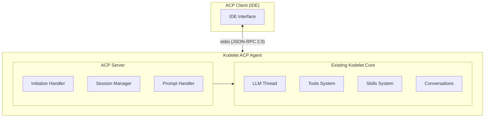

# Agent Client Protocol (ACP) Integration

## Overview

Kodelet implements the Agent Client Protocol (ACP) to integrate with ACP-compatible IDEs like Zed and JetBrains editors. ACP is an emerging standard for communication between AI coding agents and client applications, enabling seamless integration of AI agents into development workflows.

## Quick Start

To run kodelet as an ACP agent:

```bash
kodelet acp
```

This starts kodelet in agent mode, reading JSON-RPC 2.0 messages from stdin and writing responses to stdout.

## IDE Integration

### Zed

Add to your Zed settings:

```json
{
  "agent": {
    "command": "kodelet",
    "args": ["acp"]
  }
}
```

### JetBrains

Configure in Settings → Tools → AI Coding Agent:
- Command: `kodelet`
- Arguments: `acp`

## Command Line Options

```bash
kodelet acp [flags]
```

| Flag | Description |
|------|-------------|
| `--model` | LLM model to use (overrides config) |
| `--provider` | LLM provider (anthropic, openai, google) |
| `--max-tokens` | Maximum tokens for LLM responses |
| `--no-skills` | Disable agentic skills |
| `--no-hooks` | Disable lifecycle hooks |

## Protocol Overview

Kodelet implements **ACP protocol version 1** (stable). Draft/unstable features like `session/list` are not supported.

ACP uses JSON-RPC 2.0 with two message types:
- **Methods**: Request-response pairs expecting a result or error
- **Notifications**: One-way messages without responses

Communication flows through three phases:
1. **Initialization**: Version negotiation and capability exchange
2. **Session Setup**: Create or resume conversation sessions
3. **Prompt Turn**: User prompts → Agent processing → Streaming updates → Completion

## Capabilities

Kodelet advertises the following ACP capabilities:

| Capability | Description |
|------------|-------------|
| `loadSession` | Resume previous conversations |
| `promptCapabilities.image` | Support image inputs |
| `promptCapabilities.embeddedContext` | Inline file contents |
| `mcpCapabilities.http` | Connect to HTTP MCP servers |

## Session Lifecycle

### Creating a New Session

Sessions are created with `session/new`:

```json
{
  "jsonrpc": "2.0",
  "id": 1,
  "method": "session/new",
  "params": {
    "cwd": "/path/to/project"
  }
}
```

Response:
```json
{
  "jsonrpc": "2.0",
  "id": 1,
  "result": {
    "sessionId": "conv_abc123"
  }
}
```

### Sending Prompts

Use `session/prompt` to send messages:

```json
{
  "jsonrpc": "2.0",
  "id": 2,
  "method": "session/prompt",
  "params": {
    "sessionId": "conv_abc123",
    "prompt": [
      {
        "type": "text",
        "text": "What files are in this directory?"
      }
    ]
  }
}
```

### Receiving Updates

During prompt processing, kodelet sends `session/update` notifications:

```json
{
  "jsonrpc": "2.0",
  "method": "session/update",
  "params": {
    "sessionId": "conv_abc123",
    "update": {
      "sessionUpdate": "agent_message_chunk",
      "content": {
        "type": "text",
        "text": "I'll check the directory..."
      }
    }
  }
}
```

### Session Updates

| Update Type | Description |
|-------------|-------------|
| `agent_message_chunk` | Agent text output |
| `thought_chunk` | Agent thinking/reasoning |
| `tool_call` | Tool invocation started |
| `tool_call_update` | Tool status/result update |

## Tools

Kodelet uses its own built-in tools for all file and command operations, rather than delegating to client-side capabilities (`fs/*`, `terminal/*`). This ensures consistent behavior across all environments.

All kodelet tools are exposed through ACP tool calls:

| Tool | Kind | Description |
|------|------|-------------|
| `file_read` | read | Read file contents |
| `file_write` | edit | Write file contents |
| `file_edit` | edit | Edit file with diff |
| `bash` | execute | Run shell commands |
| `grep_tool` | read | Search with regex |
| `glob_tool` | read | Find files by pattern |
| `web_fetch` | fetch | Fetch web content |
| `thinking` | think | Extended reasoning |
| `subagent` | search | Code search agent |

## Session Persistence

ACP sessions are stored as kodelet conversations and can be resumed. The session ID corresponds to the conversation ID. Use `session/load` to resume a previous session:

```json
{
  "jsonrpc": "2.0",
  "id": 3,
  "method": "session/load",
  "params": {
    "sessionId": "conv_abc123",
    "cwd": "/path/to/project"
  }
}
```

## Cancellation

To cancel an in-progress prompt, send a `session/cancel` notification:

```json
{
  "jsonrpc": "2.0",
  "method": "session/cancel",
  "params": {
    "sessionId": "conv_abc123"
  }
}
```

## Architecture



## Security Considerations

1. **Path Validation**: All file paths are validated relative to the session CWD
2. **Command Restrictions**: Bash tool restrictions apply in ACP mode
3. **No Authentication**: Kodelet doesn't require authentication (handled by the client)

## References

- [Agent Client Protocol Specification](https://agentclientprotocol.com)
- [ACP GitHub Repository](https://github.com/agentclientprotocol/agent-client-protocol)
- [JSON-RPC 2.0 Specification](https://www.jsonrpc.org/specification)
