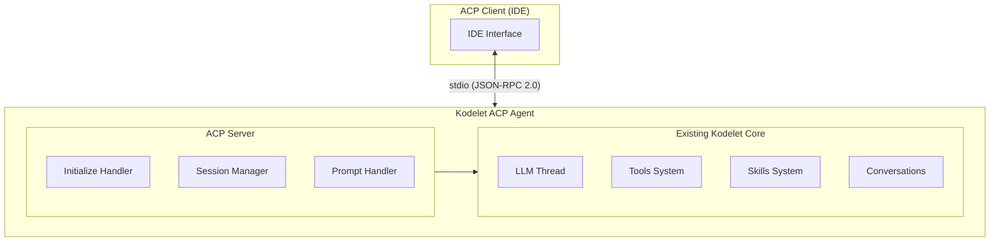

# Agent Client Protocol (ACP) Integration

## Overview

Kodelet implements the Agent Client Protocol (ACP) to integrate with ACP-compatible IDEs like Zed and JetBrains editors. ACP is an emerging standard for communication between AI coding agents and client applications, enabling seamless integration of AI agents into development workflows.

## Quick Start

To run kodelet as an ACP agent:

```bash
kodelet acp
```

This starts kodelet in agent mode, reading JSON-RPC 2.0 messages from stdin and writing responses to stdout.

To keep workspace execution local while a `kodelet serve` control plane owns the model loop and conversation store, pass `--server`:

```bash
kodelet acp --server https://kodelet.example
```

Alternatively, configure the control plane once and launch ACP without repeating the flag:

```yaml
# ~/.kodelet/config.yaml
server: https://kodelet.example
```

An explicitly selected `KODELET_CONFIG_FILE` may also provide `server`, and `KODELET_SERVER=https://kodelet.example` provides the environment-variable equivalent. An explicit `--server` value has the highest precedence. Repository-level `kodelet-config.yaml` is deliberately ignored for this security-sensitive setting.

## IDE Integration

### Zed

Add to your Zed settings:

```json
{
  "agent": {
    "command": "kodelet",
    "args": ["acp"]
  }
}
```

### JetBrains

Configure in Settings → Tools → AI Coding Agent:
- Command: `kodelet`
- Arguments: `acp`

## Command Line Options

```bash
kodelet acp [flags]
```

| Flag | Description |
|------|-------------|
| `--model` | LLM model to use (overrides config) |
| `--provider` | LLM provider (anthropic, openai) |
| `--max-tokens` | Maximum tokens for LLM responses |
| `--no-skills` | Disable agentic skills |
| `--enable-fs-search-tools` | Enable `glob_tool` and `grep_tool` (by default the agent uses `fd`/`rg` via bash) |
| `--no-extensions` | Disable extension runtime |
| `--server` | Run the model agentic loop on a control plane while keeping the current workspace runtime local; overrides `KODELET_SERVER` and user-level `server` config |
| `--auth-token` | Control-plane API token; defaults to `KODELET_AUTH_TOKEN` |
| `--runner-auth-token` | Runner registration token; defaults to `KODELET_RUNNER_AUTH_TOKEN` |
| `--runner-profile` | Runner-local environment profile used for tools, skills, extensions, context, and workspace policy |

## Server-Backed ACP

When selected by `--server`, `KODELET_SERVER`, or the user-level `server` configuration, server-backed ACP uses the stable runner for the process's current working directory. It acquires the workspace runner lock and starts an embedded runner when no owner exists; if `kodelet runner start` already holds the lock for the same server and has advertised its runner ID, ACP reuses that runner instead of registering the workspace again. The ACP client still communicates with a local stdio subprocess, which sends each prompt to the control plane's chat API.

```text
ACP client <-- stdio --> kodelet acp <-- HTTPS --> kodelet serve / model loop
                              |
                              +-- embedded or existing local runner
                                  tools, files, context, skills, recipes, extensions
```

The control plane owns provider credentials, model calls, turn orchestration, cancellation state, and persisted conversations. The local workspace runner owns the canonical workspace, context files, filesystem and shell tools, skills, recipes, extension tools and commands, local command restrictions, tool mode, and runner environment profiles.

An embedded runner executes with the ACP process's host permissions and is not a sandbox; a reused runner executes with the permissions of its existing process. API and runner tokens are captured before local extensions start and removed from the child-process environment; on Linux, Kodelet also scrubs token flag values from the process command line and disables same-user process inspection of its original environment. Supplying tokens through `KODELET_AUTH_TOKEN` and `KODELET_RUNNER_AUTH_TOKEN` avoids their initial appearance in process listings.

For new conversations, explicit `--profile` and `--reasoning-effort` values select control-plane model policy. `--runner-profile` independently selects local runner policy. Flags that configure a local model loop, including `--provider`, `--model`, `--max-tokens`, `--max-turns`, weak-model settings, thinking budget, compact ratio, Anthropic API access, and OpenAI native search, are rejected in server-backed mode.

`--no-skills`, `--no-extensions`, and `--enable-fs-search-tools` remain runner-local and override any selected runner profile when ACP owns the embedded runner. If ACP reuses an already-running runner, explicitly passing one of those process-level overrides is rejected; configure the external runner's environment profile instead. Local recipes and extension commands execute through the selected workspace runner when invoked. ACP advertises them for an embedded runner; when reusing an external runner, it currently advertises only built-in commands, although manually submitted workspace commands still execute remotely.

The server-backed process is bound to the current working directory and accepts ACP session CWDs only for that same canonical workspace. A loaded conversation must already be bound to the exact workspace runner; when `--runner-profile` was explicitly supplied, the stored conversation must also use that profile. Different ACP sessions may execute concurrently through the runner, while a single conversation still allows only one active prompt at a time. Concurrent runs share the workspace filesystem and host resources, although their run state and extension processes are isolated.

When another process already owns the workspace lock, ACP starts serving stdio immediately and lets that live runner publish its stable runner ID instead of racing it with a duplicate registration. Runner readiness is checked during session creation, loading, and prompt start; an unavailable runner produces an error after 15 seconds rather than leaving the ACP request pending indefinitely. If a reused runner releases or loses the authoritative kernel lock, later requests fail immediately with an instruction to restart ACP so it can claim the workspace and start an embedded runner. `session/cancel` immediately cancels the local prompt stream and sends a turn-specific stop request through the exact control-plane client that started the prompt, so cancellation does not wait for runner readiness. The turn identifier also lets cancellation arrive safely before the control plane has registered the chat request.

Extension tools and commands work in server-backed ACP, but ACP does not currently expose Kodelet's interactive extension UI broker, persistent widgets, or surfaces. Extensions must treat those UI capabilities as unavailable in this mode.

## Protocol Overview

Kodelet implements **ACP protocol version 1** (stable). Draft/unstable features like `session/list` are not supported.

ACP uses JSON-RPC 2.0 with two message types:
- **Methods**: Request-response pairs expecting a result or error
- **Notifications**: One-way messages without responses

Communication flows through three phases:
1. **Initialization**: Version negotiation and capability exchange
2. **Session Setup**: Create or resume conversation sessions
3. **Prompt Turn**: User prompts → Agent processing → Streaming updates → Completion

## Capabilities

Kodelet advertises the following ACP capabilities:

| Capability | Description |
|------------|-------------|
| `loadSession` | Resume previous conversations |
| `promptCapabilities.image` | Support image inputs |
| `promptCapabilities.embeddedContext` | Inline file contents |
## Session Lifecycle

### Creating a New Session

Sessions are created with `session/new`:

```json
{
  "jsonrpc": "2.0",
  "id": 1,
  "method": "session/new",
  "params": {
    "cwd": "/path/to/project"
  }
}
```

Response:
```json
{
  "jsonrpc": "2.0",
  "id": 1,
  "result": {
    "sessionId": "conv_abc123"
  }
}
```

### Sending Prompts

Use `session/prompt` to send messages:

```json
{
  "jsonrpc": "2.0",
  "id": 2,
  "method": "session/prompt",
  "params": {
    "sessionId": "conv_abc123",
    "prompt": [
      {
        "type": "text",
        "text": "What files are in this directory?"
      }
    ]
  }
}
```

### Receiving Updates

During prompt processing, kodelet sends `session/update` notifications:

```json
{
  "jsonrpc": "2.0",
  "method": "session/update",
  "params": {
    "sessionId": "conv_abc123",
    "update": {
      "sessionUpdate": "agent_message_chunk",
      "content": {
        "type": "text",
        "text": "I'll check the directory..."
      }
    }
  }
}
```

### Session Updates

| Update Type | Description |
|-------------|-------------|
| `agent_message_chunk` | Agent text output |
| `thought_chunk` | Agent thinking/reasoning |
| `tool_call` | Tool invocation started |
| `tool_call_update` | Tool status/result update |

While a streaming tool is running, Kodelet may send repeated `tool_call_update` notifications with status `in_progress` and the latest accumulated `content`. ACP clients should replace the previous content for that `toolCallId`; a later `completed` or `failed` update is authoritative. In-progress snapshots are transient and are not stored for session replay, while the final update is persisted normally.

## Tools

Kodelet uses its own built-in tools for all file and command operations, rather than delegating to client-side capabilities (`fs/*`, `terminal/*`). This ensures consistent behavior across all environments.

All kodelet tools are exposed through ACP tool calls:

| Tool | Kind | Description |
|------|------|-------------|
| `file_read` | read | Read file contents |
| `file_write` | edit | Write file contents |
| `file_edit` | edit | Edit file with diff |
| `bash` | execute | Run shell commands |
| `grep_tool` | read | Search with regex |
| `glob_tool` | read | Find files by pattern |
| `web_fetch` | fetch | Fetch web content |
| `thinking` | think | Extended reasoning |

Extensions may register additional tools; those are reported with kind `other` unless they map to a built-in kind.

## Session Persistence

ACP sessions are stored as kodelet conversations and can be resumed. In ordinary local ACP they use the local conversation store; in server-backed ACP they use the control-plane conversation store. The session ID corresponds to the conversation ID. Use `session/load` to resume a previous session:

```json
{
  "jsonrpc": "2.0",
  "id": 3,
  "method": "session/load",
  "params": {
    "sessionId": "conv_abc123",
    "cwd": "/path/to/project"
  }
}
```

## Cancellation

To cancel an in-progress prompt, send a `session/cancel` notification:

```json
{
  "jsonrpc": "2.0",
  "method": "session/cancel",
  "params": {
    "sessionId": "conv_abc123"
  }
}
```

## Architecture


```mermaid
flowchart TB
    subgraph IDE["ACP Client (IDE)"]
        client[IDE Interface]
    end

    client <-->|"stdio (JSON-RPC 2.0)"| agent

    subgraph agent["Kodelet ACP Agent"]
        subgraph server["ACP Server"]
            init[Initialize Handler]
            session[Session Manager]
            prompt[Prompt Handler]
        end

        subgraph core["Existing Kodelet Core"]
            llm[LLM Thread]
            tools[Tools System]
            skills[Skills System]
            conv[Conversations]
        end

        server --> core
    end
```

## Security Considerations

1. **Path Validation**: All file paths are validated relative to the session CWD; server-backed ACP additionally requires the session CWD to match the selected workspace runner.
2. **Command Restrictions**: Bash and tool restrictions apply in both local and server-backed ACP.
3. **Local stdio authentication**: Ordinary `kodelet acp` relies on the parent ACP client to control subprocess access and does not add an authentication exchange.
4. **Control-plane authentication**: Server-backed ACP uses `--auth-token` for API requests and `--runner-auth-token` for runner registration. Environment-provided values are captured before the runner starts and removed from the child-process environment inherited by local tools and extensions.
5. **Transport security**: Non-loopback control-plane URLs must use HTTPS.

## References

- [Agent Client Protocol Specification](https://agentclientprotocol.com)
- [ACP GitHub Repository](https://github.com/agentclientprotocol/agent-client-protocol)
- [JSON-RPC 2.0 Specification](https://www.jsonrpc.org/specification)
