# GitHub Actions Integration

Kodelet provides seamless GitHub Actions integration through the [kodelet-action](https://github.com/jingkaihe/kodelet-action), enabling automated software engineering tasks directly in your repository workflows.

## Features

* **Automated Issue Resolution** Kodelet analyses your GitHub issues and automatically generates comprehensive solutions, creating pull requests with clean, production-ready code based on your specifications. It handles complex coding tasks without manual intervention, letting you focus on higher-level architectural decisions while it manages the implementation details.
* **Intelligent Continuous Improvement** Kodelet doesn't just write code once and disappear. It iteratively improves pull requests based on your feedback and code review comments, adapting to your coding standards and project requirements.
* **Parallel Task Management** Scale your development capacity by delegating multiple coding tasks simultaneously. You can assign as many issues as needed to Kodelet, and it will work on them in parallel, maximising your development velocity without requiring you to manage the workload distribution.
* **Integrate into your workflow** Simply mention `@kodelet` in any GitHub issue or pull request to engage your AI coding assistant. Kodelet will spring into github action, analysing your requirements and delivering high-quality solutions tailored to your project.

## Quick Start

### 1. Setup API Key

Add your Anthropic API key to your repository secrets:

1. Go to your repository → Settings → Secrets and variables → Actions
2. Click "New repository secret"
3. Name: `ANTHROPIC_API_KEY`
4. Value: Your Anthropic API key (starts with `sk-ant-`)

### 2. Create Workflow File

Create `.github/workflows/kodelet.yml` in your repository:

```yaml
name: Background Kodelet
on:
  issue_comment:
    types: [created]
  issues:
    types: [opened, assigned]
  pull_request_review_comment:
    types: [created]
  pull_request_review:
    types: [submitted]


jobs:
  background-agent:
    runs-on: ubuntu-latest
    permissions:
      id-token: write
      issues: read
      pull-requests: read
      contents: read
    timeout-minutes: 15  # 15 minutes
    if: |
      (
        (github.event_name == 'issues' && contains(github.event.issue.body, '@kodelet')) ||
        (github.event_name == 'issue_comment' && contains(github.event.comment.body, '@kodelet')) ||
        (github.event_name == 'pull_request_review_comment' && contains(github.event.comment.body, '@kodelet')) ||
        (github.event_name == 'pull_request_review' && contains(github.event.review.body, '@kodelet'))
      ) &&
      (
        (github.event.issue.author_association == 'OWNER' || github.event.issue.author_association == 'MEMBER' || github.event.issue.author_association == 'COLLABORATOR') ||
        (github.event.comment.author_association == 'OWNER' || github.event.comment.author_association == 'MEMBER' || github.event.comment.author_association == 'COLLABORATOR') ||
        (github.event.review.author_association == 'OWNER' || github.event.review.author_association == 'MEMBER' || github.event.review.author_association == 'COLLABORATOR')
      )

    steps:
      - name: Checkout Repository
        uses: actions/checkout@v4
        with:
          token: ${{ secrets.GITHUB_TOKEN }}
      - name: Setup your dev environment
        run: |
          echo "YMMV"
      - name: Run Kodelet
        uses: jingkaihe/kodelet-action@v0.1.7-alpha
        with:
          anthropic-api-key: ${{ secrets.ANTHROPIC_API_KEY }}
          # All other inputs are automatically populated from GitHub context
```

### 3. Trigger Kodelet

Comment `@kodelet` on any issue or pull request to trigger automated assistance:

- **Issues**: `@kodelet please fix this bug`
- **PRs**: `@kodelet review this code`
- **PR Reviews**: Include `@kodelet` in review comments

## How It Works

```mermaid
flowchart LR
    A[User mentions @kodelet] --> B{Event Type}

    B -->|issues.opened| C1[Issue Created]
    B -->|issue_comment| C2[Issue Comment]
    B -->|issue_comment on PR| C3[PR Comment]
    B -->|pull_request_review_comment| C4[PR Review Comment]

    C1 --> D[Check Permissions]
    C2 --> D
    C3 --> D
    C4 --> D

    D --> E{User has OWNER/MEMBER/COLLABORATOR access?}
    E -->|No| F[Action Skipped]
    E -->|Yes| G[Start Kodelet Action]

    G --> H{GitHub Token Provided?}
    H -->|Yes| I[Use Provided Token]
    H -->|No| J[Auth Gateway OIDC]

    I --> K[Post Status Comment]
    J --> K

    K --> L[Install Kodelet CLI]
    L --> M[Configure Git]
    M --> N[Parse Event Context]

    N --> O{Route Command}
    O -->|Issue| P[kodelet issue-resolve]
    O -->|PR Comment| Q[kodelet pr-respond --issue-comment-id]
    O -->|PR Review| R[kodelet pr-respond --review-id]

    P --> S[Execute Kodelet]
    Q --> S
    R --> S

    S --> T{Success?}
    T -->|Yes| U[✅ Task Complete]
    T -->|No| V[❌ Post Error Comment]

    style A fill:#e3f2fd
    style G fill:#f3e5f5
    style S fill:#e8f5e8
    style U fill:#c8e6c8
    style V fill:#ffcdd2
    style F fill:#f5f5f5
```



## Inputs

| Input | Description | Required | Default |
|-------|-------------|----------|---------|
| `anthropic-api-key` | Anthropic API key for AI operations | Yes | N/A |
| `github-token` | GitHub token for repository operations | No | Auth Gateway OIDC |
| `commenter` | Username who triggered the action | No | Auto-detected |
| `event-name` | GitHub event name | No | Auto-detected |
| `issue-number` | Issue number | No | Auto-detected |
| `comment-id` | Comment ID | No | Auto-detected |
| `review-id` | Review ID | No | Auto-detected |
| `repository` | Repository (owner/repo) | No | Auto-detected |
| `is-pr` | Is this a pull request? | No | Auto-detected |
| `pr-number` | Pull request number | No | Auto-detected |
| `timeout-minutes` | Execution timeout | No | `300` |
| `log-level` | Logging level | No | `info` |
| `kodelet-version` | Kodelet CLI version | No | `latest` |

## Usage Examples

### Basic Usage (Minimal Configuration)

```yaml
- uses: jingkaihe/kodelet-action@v0.1.7-alpha
  with:
    anthropic-api-key: ${{ secrets.ANTHROPIC_API_KEY }}
    # All other inputs are automatically populated from GitHub context
```

### Auth Gateway Authentication

**Default & Recommended** - Uses OIDC with GitHub's auth gateway:

```yaml
- uses: jingkaihe/kodelet-action@v0.1.7-alpha
  with:
    anthropic-api-key: ${{ secrets.ANTHROPIC_API_KEY }}
    # github-token is automatically handled via OIDC
```

Required permissions:
```yaml
permissions:
  id-token: write
  issues: read
  pull-requests: read
  contents: read
```

### Custom Configuration

```yaml
- uses: jingkaihe/kodelet-action@v0.1.7-alpha
  with:
    anthropic-api-key: ${{ secrets.ANTHROPIC_API_KEY }}
    timeout-minutes: 180  # 3 hours
    log-level: debug
    kodelet-version: v0.0.35.alpha  # Pin to specific version
```

### Manual Override (if needed)

If you need to override the automatic token detection:

```yaml
- uses: jingkaihe/kodelet-action@v0.1.7-alpha
  with:
    anthropic-api-key: ${{ secrets.ANTHROPIC_API_KEY }}
    github-token: ${{ secrets.GITHUB_TOKEN }}
```

Required permissions for manual override:
```yaml
permissions:
  issues: write
  pull-requests: write
  contents: write
```

### Environment Variables

Configure Kodelet through environment variables:

```yaml
- uses: jingkaihe/kodelet-action@v0.1.7-alpha
  with:
    anthropic-api-key: ${{ secrets.ANTHROPIC_API_KEY }}
  env:
    KODELET_PROVIDER: "anthropic"
    KODELET_MODEL: "claude-sonnet-4-20250514"
    KODELET_MAX_TOKENS: "8192"
```

### Version Pinning

**Production environments** should pin to specific versions:

```yaml
# Latest stable
- uses: jingkaihe/kodelet-action@v0.1.7-alpha

# Specific version
- uses: jingkaihe/kodelet-action@v0.1.7-alpha

# Development (not recommended)
- uses: jingkaihe/kodelet-action@main
```

### Kodelet Configuration

Place `kodelet-config.yaml` in your repository root:

```yaml
provider: anthropic
model: claude-sonnet-4-20250514
max_tokens: 8192
tracing:
  enabled: false
```

## Supported Events

| Event | Description |
|-------|-------------|
| `issue_comment` | Comments on issues |
| `issue_comment` (on PR) | Comments on pull requests |
| `pull_request_review_comment` | Inline PR review comments |
| `pull_request_review` | PR review submissions |

## Workflow Trigger Conditions

The action only runs when:

1. **Event contains `@kodelet`**: The trigger event (comment, issue, review) must contain `@kodelet`
2. **Author has proper permissions**: Only users with `OWNER`, `MEMBER`, or `COLLABORATOR` association can trigger the action (highly recommended for public repos, but not mandatory)
3. **Supported event types**: Only specific GitHub events are supported (see table above)

### Trigger Examples

**Issue Comments:**
```
@kodelet please fix this bug by implementing proper error handling
```

**Pull Request Comments:**
```
@kodelet review this code and suggest improvements
```

**Pull Request Review Comments:**
```
This function looks complex. @kodelet can you refactor this?
```

## Permissions

The action requires the following GitHub permissions:

**For Auth Gateway (Default & Recommended):**
```yaml
permissions:
  id-token: write
  issues: read
  pull-requests: read
  contents: read
```

**For Manual Override:**
```yaml
permissions:
  issues: write          # Comment on issues
  pull-requests: write   # Comment on PRs and create PRs
  contents: write        # Push commits and create branches
```

## GitHub Authentication Token Considerations

### 1. Auth Gateway (Default & Recommended)

The action uses GitHub's OIDC to authenticate with an auth gateway service that provides elevated permissions automatically. This is the **most secure and convenient** option.

**Benefits:**
- No token management required
- Automatic permission elevation
- Secure credential handling
- Simplified workflow setup

**Setup:**
```yaml
permissions:
  id-token: write
  issues: read
  pull-requests: read
  contents: read

steps:
  - uses: jingkaihe/kodelet-action@v0.1.7-alpha
    with:
      anthropic-api-key: ${{ secrets.ANTHROPIC_API_KEY }}
      # github-token is automatically handled
```

### 2. Standard GitHub Token

Uses the default `GITHUB_TOKEN` provided by GitHub Actions. **Limited permissions** - can only comment, cannot create PRs or push commits.

**Limitations:**
- Cannot create pull requests
- Cannot push commits to new branches
- Can only post comments

**Setup:**
```yaml
permissions:
  issues: write
  pull-requests: write

steps:
  - uses: jingkaihe/kodelet-action@v0.1.7-alpha
    with:
      anthropic-api-key: ${{ secrets.ANTHROPIC_API_KEY }}
      github-token: ${{ secrets.GITHUB_TOKEN }}
```

### 3. Personal Access Token (PAT)

Use a fine-grained or classic PAT for full repository access.

**Pros:**
- Full repository access and control
- Can create pull requests and push commits
- Works consistently across all repository types

**Limitations:**
- Create PAT with necessary permissions
- Store in repository secrets
- More token management overhead
- Security responsibility for token rotation

**Setup:**
```yaml
steps:
  - uses: jingkaihe/kodelet-action@v0.1.7-alpha
    with:
      anthropic-api-key: ${{ secrets.ANTHROPIC_API_KEY }}
      github-token: ${{ secrets.PERSONAL_ACCESS_TOKEN }}
```

### 4. Custom Auth Gateway

For the purpose of enterprise deployment or additional security compliance requirements, advanced users can configure their own auth gateway endpoint:

```yaml
- uses: jingkaihe/kodelet-action@v0.1.7-alpha
  with:
    anthropic-api-key: ${{ secrets.ANTHROPIC_API_KEY }}
    auth-gateway-endpoint: "https://your-auth-gateway.com/api/github"
```

**Note**: The source code of the GitHub Actions auth gateway will be open sourced soon to enable self-hosted deployments for enterprise environments.

### Recommendation

Use **Auth Gateway** (option 1) for the best balance of security, functionality, and ease of setup. It provides all necessary permissions automatically while maintaining security best practices.

## Security

- **API Keys**: Store your Anthropic API key in GitHub Secrets, never in code
- **GitHub Token**: Uses auth gateway or provided token with appropriate scope
- **Repository Access**: Only maintainers/collaborators can trigger the action
- **Timeout Protection**: Execution is limited by configurable timeout

## Error Handling

The action automatically handles errors and posts informative comments when execution fails:

- API rate limits or service unavailability
- Complex requirements needing human intervention
- Environmental or dependency issues
- Timeout exceeded

Failed runs include links to workflow logs for debugging.

## Troubleshooting

### Common Issues

1. **Action not triggering**
   - Ensure `@kodelet` is included in the comment/issue
   - Check that the user has proper repository permissions
   - Verify the workflow file is in `.github/workflows/`

2. **API errors**
   - Verify `ANTHROPIC_API_KEY` is set correctly in repository secrets
   - Check API key has sufficient credits/quota

3. **Permission errors**
   - Ensure workflow has proper `permissions` section
   - Verify `GITHUB_TOKEN` has required scopes


### Debugging

Enable debug logging for more detailed output:

```yaml
- uses: jingkaihe/kodelet-action@v0.1.7-alpha
  with:
    anthropic-api-key: ${{ secrets.ANTHROPIC_API_KEY }}
    log-level: debug
```

## Versioning

This action follows semantic versioning:

- **Latest stable**: `@v0.1.7-alpha`
- **Specific version**: `@v0.1.7-alpha`
- **Development**: `@main` (not recommended for production)

## Best Practices

1. **Pin versions in production**: Use specific version tags for stability
2. **Set appropriate timeouts**: Balance between allowing complex tasks and preventing runaway processes
3. **Monitor usage**: Keep track of API usage and costs
4. **Use descriptive comments**: Be specific about what you want Kodelet to do
5. **Review before merging**: Always review Kodelet's changes before merging

## Examples from Kodelet Repository

The Kodelet repository itself uses this action. See [`.github/workflows/kodelet-background.yml`](../.github/workflows/kodelet-background.yml) for a real-world example of the configuration in use.

## Support

- [Kodelet Documentation](https://github.com/jingkaihe/kodelet)
- [Report Issues](https://github.com/jingkaihe/kodelet-action/issues)
- [Discussions](https://github.com/jingkaihe/kodelet-action/discussions)
- [GitHub Marketplace](https://github.com/marketplace/actions/kodelet-action)
