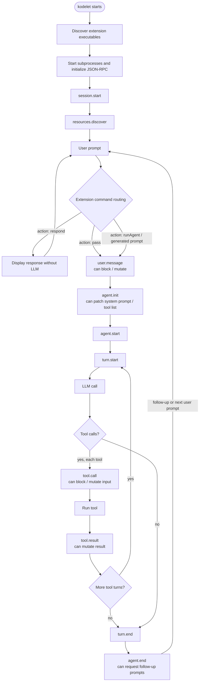

# Kodelet Extension Design

## Context

Kodelet currently has two separate extension mechanisms:

- **Custom tools**: executable files discovered from configured tool directories. Each tool exposes a small executable protocol (`description`, optional `config`, and `run`).
- **Lifecycle hooks**: executable files discovered from hook directories. Each hook exposes a hook type and is invoked by shelling out on every matching lifecycle event.

This is simple, but it creates a poor authoring experience:

- Each hook must be maintained as a standalone executable.
- Hook and custom-tool protocols are separate.
- The interface is not type-safe or consistent.
- Hook execution is stateless unless authors persist state externally.
- Shelling out for every event is inefficient and makes richer event flows brittle.

This document proposes replacing hooks and executable custom tools with a unified **Extension** primitive.

## Goals

- Provide one primitive that covers:
  - model-invoked tools;
  - agent lifecycle event handlers;
  - prompt-level extension commands.
- Allow extension implementations to keep in-memory state during a Kodelet process.
- Provide a consistent TypeScript-friendly DSL with Zod-based schema definitions.
- Use a structured protocol between Kodelet and extension processes.
- Rip out the existing hooks and executable custom tools as part of the change. This is a breaking change, but acceptable because current usage is minimal.
- Add explicit `extensions` configuration.

## Non-goals

- This design does not require embedding a JavaScript runtime inside the Go binary.
- This design does not preserve the current hook or custom-tool executable protocols.
- This design does not define a full sandboxing model beyond process isolation and explicit configuration.

## User-facing extension API

An extension is an executable process that registers tools, commands, and lifecycle event handlers. A TypeScript authoring package can hide the JSON-RPC details.

Example:

```typescript
import { z, type ExtensionAPI } from "kodelet";

const WeatherInput = z.object({
  location: z.string().describe("Location to fetch weather for"),
});

export default function (ext: ExtensionAPI) {
  ext.registerTool({
    name: "get_weather",
    description: "Get the current weather for a location",
    inputSchema: WeatherInput,
    timeoutInSec: 600,
    async execute(input, ctx) {
      ctx.log.info(`Fetching weather for ${input.location}`);

      return {
        content: `Weather for ${input.location}: 18°C, cloudy`,
        data: {
          location: input.location,
          temperatureC: 18,
          condition: "cloudy",
        },
      };
    },
  });

  ext.on("tool.call", { timeoutInSec: 5 }, async (event) => {
    if (
      event.tool.name === "bash" &&
      typeof event.tool.input.command === "string" &&
      event.tool.input.command.includes("rm -rf /")
    ) {
      return {
        block: {
          reason: "Refusing dangerous shell command",
        },
      };
    }
  });

  ext.on("tool.result", async (event) => {
    // Observe or modify tool output before it is rendered/sent back to the model.
    return;
  });

  ext.on("agent.init", async () => {
    return {
      systemPrompt: {
        append: "Prefer concise answers unless the user explicitly asks for detail.",
      },
    };
  });
}
```

For TypeScript extensions, `inputSchema` should accept a Zod schema. The `kodelet` SDK should re-export `z` from Zod so extension authors get an all-in-one import and do not need to depend on or import `zod` directly. The SDK converts Zod to JSON Schema during registration before sending metadata to Kodelet. Non-TypeScript extensions can still speak the protocol directly by returning JSON Schema in their `extension.initialize` result.

The SDK should infer the handler input type from the schema, equivalent to:

```typescript
type WeatherInput = z.infer<typeof WeatherInput>;
```

Kodelet itself should only need the generated JSON Schema for LLM tool registration and input validation. Zod is an SDK authoring convenience, not a protocol dependency.

## Extension discovery

Kodelet should discover extension executables from configured extension roots. By default these roots are:

1. `./.kodelet/extensions`
2. `~/.kodelet/extensions`
3. repo-local plugin extension directories
4. global plugin extension directories

Within each root, Kodelet loads executables matching either of these shapes:

```text
.kodelet/extensions/kodelet-extension-xxx
.kodelet/extensions/*/kodelet-extension-xxx
```

The same matching rule applies to any configured global root or plugin extension root:

```text
<extension-root>/kodelet-extension-xxx
<extension-root>/*/kodelet-extension-xxx
```

Where:

- `kodelet-extension-xxx` is an executable file and the required extension process entry point name.
- The extension ID/name is derived as:
  - `xxx` for `<root>/kodelet-extension-xxx`;
  - the parent directory name for `<root>/<name>/kodelet-extension-xxx`.
- No manifest is required. Extension metadata is reported by the executable during JSON-RPC initialization.

Examples:

```text
.kodelet/extensions/kodelet-extension-weather
.kodelet/extensions/security/kodelet-extension-guardrails
~/.kodelet/extensions/kodelet-extension-gh
~/.kodelet/extensions/cloud/kodelet-extension-aws
```

Recommended package layout for a TypeScript extension:

```text
.kodelet/extensions/weather/
  package.json
  src/index.ts
  dist/index.js
  kodelet-extension-weather
```

The executable `kodelet-extension-weather` can be a small wrapper around a shared runner:

```bash
#!/usr/bin/env bash
exec kodelet-extension-node ./dist/index.js
```

### Discovery precedence

Use the same precedence model as existing Kodelet plugin discovery:

1. Repo-local standalone extensions.
2. Repo-local plugin extensions.
3. Global standalone extensions.
4. Global plugin extensions.

If two extensions provide the same extension ID, the earlier source wins and the lower-precedence extension is skipped with a debug log.

If two extensions register the same tool or command name, the runtime should reject the later registration unless explicitly configured to allow shadowing.

## Configuration

Add a top-level `extensions` config block.

Configuration is read from the normal Kodelet config locations, including:

- global config: `~/.kodelet/config.yaml`
- repo-local config: `./kodelet-config.yaml`

Example:

```yaml
extensions:
  enabled: true

  global_dir: ~/.kodelet/extensions
  local_dir: ./.kodelet/extensions

  max_output_size: 102400

  # Plugin extensions are addressed by plugin package and extension name.
  # Standalone extensions are addressed by extension path, either relative
  # to the current working directory or absolute.
  allow:
    - org@repo/security
    - ./.kodelet/extensions/weather
    - ~/.kodelet/extensions/kodelet-extension-gh

  deny:
    - org@repo/experimental-extension
    - /absolute/path/to/kodelet-extension-experimental

  tools:
    get_weather:
      enabled: true

```

Configuration semantics:

- `enabled`: disables all extension discovery and execution when false.
- `global_dir`: global standalone extension root.
- `local_dir`: repo-local standalone extension root.
- `max_output_size`: max assistant-facing output accepted from extension tools.
- `allow`: optional extension allowlist. Plugin entries use `org@repo/extension`; standalone entries use extension paths, either relative or absolute.
- `deny`: optional extension denylist using the same addressing rules as `allow`.
- `tools`: per-tool enablement configuration.
Timeouts are controlled by SDK-declared `timeoutInSec`. Events use SDK `timeoutInSec` or the built-in `30s` default, tools use SDK `timeoutInSec` or the built-in `10m` default, and commands use SDK `timeoutInSec` or no timeout.

Allow/deny path entries are normalized before comparison:

- `~` is expanded to the user home directory.
- relative paths are resolved against the current working directory.
- directory paths match the discovered extension directory.
- executable paths match the discovered `kodelet-extension-xxx` executable.

If both `allow` and `deny` match an extension, `deny` wins.

Suggested CLI flags:

```bash
kodelet run --no-extensions "..."
kodelet extension list
kodelet extension inspect weather
kodelet extension reload
kodelet extension dev ./.kodelet/extensions/weather
```

## Runtime architecture

Add a new Go package:

```text
pkg/extensions/
  config.go
  discovery.go
  runtime.go
  registry.go
  dispatcher.go
  process.go
  protocol.go
  tool.go
  command.go
```

High-level architecture:

```text
╭──────────────╮
│ kodelet CLI  │
│ / serve /ACP │
╰──────┬───────╯
       │ startup
       ▼
╭────────────────────╮
│ Extension Runtime  │
│ - discovery        │
│ - supervisor       │
│ - registry         │
│ - dispatcher       │
╰──────┬─────────────╯
       │ stdio JSON-RPC
       ▼
╭────────────────────╮
│ Extension Process  │
│ weather            │
│                    │
│ registerTool(...)  │
│ on("tool.call")    │
│ on("agent.init")   │
╰────────────────────╯
```

Host-side runtime interface:

```go
type Runtime struct {
    registry   *Registry
    supervisor *Supervisor
    dispatcher *Dispatcher
}

func (r *Runtime) Tools() []tooltypes.Tool
func (r *Runtime) Commands() []Command
func (r *Runtime) DispatchEvent(ctx context.Context, event Event) (EventResult, error)
func (r *Runtime) Shutdown(ctx context.Context) error
```

An `ExtensionTool` implements the existing `tooltypes.Tool` interface so extension tools can join the normal tool list alongside built-ins.

## JSON-RPC protocol

Use JSON-RPC 2.0 over stdio with LSP-style `Content-Length` framing.

Rules:

- `stdout` is protocol only.
- `stderr` is logs.
- Requests use the effective timeout from config, SDK `timeoutInSec`, and runtime defaults. Extension commands may run without a timeout by default.
- Extensions can call back into the host for UI interactions using separate reverse-RPC methods: `kodelet.ui.input`, `kodelet.ui.confirm`, `kodelet.ui.select`, and `kodelet.ui.notify`.
- Cancellation uses `$/cancelRequest`.
- If an extension hangs after cancellation, Kodelet kills and restarts it.
- The host supervises processes with exponential backoff.

### Initialization

Kodelet starts the extension executable, then sends:

```json
{
  "jsonrpc": "2.0",
  "id": 1,
  "method": "extension.initialize",
  "params": {
    "protocolVersion": "2026-05-30",
    "kodelet": {
      "version": "x.y.z"
    },
    "extension": {
      "id": "weather",
      "config": {},
      "cwd": "/home/user/project",
      "dataDir": "/home/user/.kodelet/extensions/data/weather"
    },
    "capabilities": {
      "tools": true,
      "commands": true,
      "ui": {
        "input": true,
        "confirm": true,
        "select": true,
        "notify": true
      },
      "events": [
        "session.start",
        "resources.discover",
        "user.message",
        "agent.init",
        "agent.start",
        "turn.start",
        "tool.call",
        "tool.result",
        "turn.end",
        "agent.end"
      ]
    }
  }
}
```

The extension responds with registrations:

```json
{
  "jsonrpc": "2.0",
  "id": 1,
  "result": {
    "name": "weather",
    "version": "0.1.0",
    "tools": [
      {
        "name": "get_weather",
        "description": "Get the current weather for a location",
        "inputSchema": {
          "type": "object",
          "properties": {
            "location": { "type": "string" }
          },
          "required": ["location"]
        }
      }
    ],
    "commands": [],
    "subscriptions": [
      { "event": "tool.call", "priority": 0 },
      { "event": "tool.result", "priority": 0 },
      { "event": "agent.init", "priority": 0 }
    ]
  }
}
```

### Tool execution

When the LLM calls `get_weather`, Kodelet sends:

```json
{
  "jsonrpc": "2.0",
  "id": 42,
  "method": "extension.tool.execute",
  "params": {
    "name": "get_weather",
    "input": {
      "location": "London"
    },
    "context": {
      "sessionId": "sess_123",
      "conversationId": "conv_456",
      "cwd": "/home/user/project",
      "provider": "anthropic",
      "model": "claude-sonnet-4-6",
      "profile": "default",
      "recipeName": "",
      "invokedBy": "main"
    }
  }
}
```

The extension responds:

```json
{
  "jsonrpc": "2.0",
  "id": 42,
  "result": {
    "content": "Weather for London: 18°C, cloudy",
    "data": {
      "temperatureC": 18,
      "condition": "cloudy"
    }
  }
}
```

Kodelet maps this into a structured tool result with extension-specific metadata:

```go
ExtensionToolMetadata{
    ExtensionID: "weather",
    ToolName: "get_weather",
    Output: "Weather for London: 18°C, cloudy",
    Data: map[string]any{...},
}
```

## Event model

Use dot-separated event names.

| Event | When | Can block? | Can mutate? |
|---|---|---:|---:|
| `session.start` | Extension runtime starts | No | No |
| `resources.discover` | Before commands/tools/resources are finalized | No | Yes, resource registrations |
| `user.message` | User prompt received | Yes | Yes, message |
| `agent.init` | After normal system prompt is built, before first model request | No | Yes, system prompt / allowed tools |
| `agent.start` | Agent loop starts | No | No |
| `turn.start` | Before each model call | No | Maybe later |
| `tool.call` | Before a tool runs | Yes | Yes, tool input |
| `tool.result` | After tool runs, before render/model ingestion | No | Yes, tool result |
| `turn.end` | After one assistant turn completes | No | No initially |
| `agent.end` | Agent has completed | No | Yes, follow-up messages |
| `session.end` | Kodelet shuts down extension runtime | No | No |

Breaking-change replacement mapping from the removed hook system:

| Removed hook | Extension event |
|---|---|
| `before_tool_call` | `tool.call` |
| `after_tool_call` | `tool.result` |
| `user_message_send` | `user.message` |
| `agent_stop` | `agent.end` |
| `turn_end` | `turn.end` |

### Event envelope

Every event gets a consistent envelope:

```typescript
interface ExtensionContext {
  sessionId: string;
  conversationId: string;
  cwd: string;
  provider: string;
  model: string;
  profile?: string;
  recipeName?: string;
  invokedBy: "main" | "subagent";
  turnNumber?: number;
}

interface EventEnvelope<Name extends EventName, Payload> {
  id: string;
  event: Name;
  context: ExtensionContext;
  payload: Payload;
}
```

Example `tool.call` payload:

```typescript
interface ToolCallEvent {
  tool: {
    name: string;
    callId: string;
    input: unknown;
  };
}
```

Handler result:

```typescript
type ToolCallResult =
  | void
  | {
      input?: unknown;
      block?: {
        reason: string;
      };
    };
```

Example `agent.init` result:

```typescript
interface AgentInitResult {
  systemPrompt?: {
    prepend?: string;
    append?: string;
    replace?: string;
  };
  tools?: {
    disable?: string[];
    enable?: string[];
  };
}
```

## Event dispatch semantics

For mutating/blocking events, run handlers sequentially in deterministic order:

1. Higher-priority handlers first.
2. Then discovery precedence.
3. Then registration order inside the extension.

For `tool.call`:

```text
original input
  │
  ▼
extension A handler
  │ maybe mutates input
  ▼
extension B handler
  │ maybe blocks
  ▼
tool executes with final input
```

For blocking events, use deny-fast semantics:

- The first block stops execution.
- Later handlers do not run.
- Kodelet returns a blocked tool result or blocked user message.

For observational events, Kodelet may eventually run handlers concurrently, but the initial implementation should use sequential execution for simpler state semantics.

## Extension commands and dynamic recipes

Extensions may register prompt-level commands that run before agent execution. A command can either handle the request directly or behave like a dynamic recipe by returning an agent prompt for Kodelet to run.

This makes `registerCommand` the extension-native replacement for executable/dynamic recipe behavior. Static Markdown recipes can continue to exist as the lightweight file-based template format, but extensions should not need a separate `registerRecipe` API unless a future use case requires it. Recipe-like commands should be discoverable and invokable wherever recipes are surfaced.

Direct-response command example:

```typescript
const OpenInput = z.object({
  path: z.string().optional(),
});

ext.registerCommand({
  name: "open",
  aliases: ["/open"],
  description: "Open the current project or a project-relative path in the configured editor",
  inputSchema: OpenInput,
  async execute(input, ctx) {
    const target = ctx.path.resolveWorkspacePath(input.path ?? ".");

    if (!(await ctx.fs.exists(target))) {
      return {
        action: "respond",
        response: `Cannot open ${ctx.path.relativeToWorkspace(target)} because it does not exist.`,
      };
    }

    const editor = ctx.env.get("EDITOR") ?? "code";
    await ctx.process.spawn(editor, [target], { detach: true });
    ctx.log.info(`Opened ${target} with ${editor}`);

    return {
      action: "respond",
      response: `Opened ${ctx.path.relativeToWorkspace(target)} in ${editor}.`,
    };
  },
});
```

Recipe-like command example:

```typescript
const ReviewInput = z.object({
  target: z.string().default("HEAD"),
  focus: z.string().optional(),
});

ext.registerCommand({
  name: "review",
  aliases: ["/review"],
  description: "Run an extension-provided code review recipe",
  inputSchema: ReviewInput,
  kind: "recipe",
  timeoutInSec: 1800,
  async execute(input, ctx) {
    return {
      action: "runAgent",
      recipeName: "review",
      prompt: [
        `Review ${input.target}.`,
        input.focus ? `Focus on: ${input.focus}.` : "Focus on correctness, simplicity, and tests.",
      ].join("\n"),
    };
  },
});
```

Flow:

```text
╭─────────────╮
│ User prompt │
╰──────┬──────╯
       ▼
╭─────────────────────╮
│ Extension commands  │
│ checked first       │
╰──────┬──────────────╯
       │ action: respond
       ▼
╭─────────────────────╮
│ Return response     │
│ without LLM         │
╰─────────────────────╯

If action: pass:
       │
       ▼
╭─────────────────────╮
│ user.message event  │
╰─────────────────────╯
```

Command result options:

```typescript
type CommandResult =
  | { action: "pass" }
  | { action: "respond"; response: string }
  | {
      action: "runAgent";
      prompt: string;
      recipeName?: string;
    };
```

Result semantics:

- `action` is a discriminant that tells Kodelet what to do next.
- `{ action: "pass" }`: command did not match, failed validation, or intentionally declined to handle the prompt. Kodelet continues command routing and, if no command acts on it, continues normal prompt processing.
- `{ action: "respond", response }`: command consumed the prompt and handled it directly. `response` is displayed to the user in the terminal/web UI and is **not** appended to the conversation or fed into the LLM.
- `{ action: "runAgent", prompt }`: command consumed the original prompt by producing a replacement agent prompt. Kodelet starts the normal agent flow using `prompt`; this prompt enters the conversation as the effective user message.

This distinction is important: direct command responses are UI output, while recipe-like command prompts are LLM input.

Command registration metadata:

```typescript
interface CommandRegistration<Input = unknown> {
  name: string;
  aliases?: string[];
  description: string;
  inputSchema?: ZodSchema<Input>;
  kind?: "command" | "recipe";
  execute(input: Input, ctx: CommandContext): Promise<CommandResult>;
}
```

Suggested `CommandContext` surface:

```typescript
interface CommandContext {
  sessionId: string;
  conversationId?: string;
  cwd: string;
  provider?: string;
  model?: string;
  profile?: string;
  recipeName?: string;

  // Original user text and parsed command details.
  input: {
    raw: string;
    commandName: string;
    args: string[];
    flags: Record<string, string | boolean | string[]>;
  };

  // Extension-specific persistent data directory.
  storage: {
    dataDir: string;
    readText(path: string): Promise<string | undefined>;
    writeText(path: string, content: string): Promise<void>;
    readJson<T = unknown>(path: string): Promise<T | undefined>;
    writeJson(path: string, value: unknown): Promise<void>;
  };

  // Workspace-safe helpers. Paths should be resolved/canonicalized by the SDK.
  path: {
    resolveWorkspacePath(path: string): string;
    relativeToWorkspace(path: string): string;
  };

  fs: {
    exists(path: string): Promise<boolean>;
    readText(path: string): Promise<string>;
    writeText(path: string, content: string): Promise<void>;
    list(path: string): Promise<Array<{ name: string; path: string; type: "file" | "dir" | "other" }>>;
  };

  process: {
    exec(command: string, args?: string[], opts?: { cwd?: string; timeoutMs?: number }): Promise<{
      stdout: string;
      stderr: string;
      exitCode: number;
    }>;
    spawn(command: string, args?: string[], opts?: { cwd?: string; detach?: boolean }): Promise<void>;
  };

  env: {
    get(name: string): string | undefined;
  };

  log: {
    debug(message: string, fields?: Record<string, unknown>): void;
    info(message: string, fields?: Record<string, unknown>): void;
    warn(message: string, fields?: Record<string, unknown>): void;
    error(message: string, fields?: Record<string, unknown>): void;
  };
}
```

The context should intentionally be narrower than arbitrary Node.js globals. Extension code still runs as a normal subprocess and can use its language runtime directly, but SDK-provided helpers give Kodelet a consistent place for path normalization, logging, timeout handling, future permissions, and tests.

When `kind: "recipe"` is set, Kodelet should:

- include the command in recipe discovery/listing surfaces;
- allow invocation through recipe-style UX, for example `kodelet run -r review` if the CLI keeps that interface;
- still allow direct command invocation, for example `/review target=main`;
- set `recipeName` in lifecycle context to the command/recipe name while the generated prompt runs.

This unifies recipes and commands without forcing all recipes to become extensions: Markdown recipes remain simple static templates, while extension commands cover dynamic recipes that need code, external APIs, state, or richer argument parsing.

## Lifecycle overview



## Security model

Long-running repo-local executables are sensitive. Recommended defaults:

1. Installed or downloaded extensions are considered trusted. There is no separate `trusted_extensions` database.
2. Users control extension loading through `extensions.enabled`, `extensions.allow`, and `extensions.deny` in global or repo-local config.
3. Extension processes inherit the Kodelet process environment. Users should install only trusted extensions and use normal process environment controls for secrets.
4. Local repositories can opt into or out of extensions using `./kodelet-config.yaml`.

## Failure and timeout policy

Per extension process:

- Startup failure: disable extension for the current Kodelet process and warn.
- Event timeout: cancel request, log a warning, and continue with the unmodified event payload/result.
- Tool timeout: return a tool error.
- Process crash:
  - mark in-flight tool calls as failed;
  - continue unmodified for in-flight events;
  - restart lazily on the next request with backoff.
- Repeated crashes: disable extension for the current Kodelet process.

## Migration plan

This change is intentionally breaking. Remove the existing hook and executable custom-tool systems as part of the extension implementation rather than maintaining compatibility adapters.

### Phase 1: Remove legacy primitives

Remove or disable:

- `pkg/hooks` and all direct hook trigger/executor wiring;
- `hooks/` plugin installation/listing support;
- executable custom tool discovery and invocation;
- `tools/` plugin installation/listing support for executable custom tools;
- `custom_tools` config support;
- `--no-hooks` and custom-tool-specific CLI commands/docs.

Replace user-facing documentation with extension documentation.

### Phase 2: Runtime skeleton

Add `pkg/extensions` with:

- config loading;
- extension discovery;
- process supervision;
- JSON-RPC client;
- registry for tools, commands, and subscriptions;
- unit tests with fake extension processes.

No agent integration is required in this phase.

### Phase 3: TypeScript SDK

Add a `kodelet` TypeScript SDK for authoring extensions.

Required SDK surface:

- `ExtensionAPI` type;
- `defineExtension(fn)` helper, if useful for better inference;
- `z` re-export from Zod for all-in-one imports;
- `registerTool(...)` with Zod-inferred input types;
- `registerCommand(...)` with Zod-inferred input types;
- `on(event, handler)` with typed event payloads and typed handler results;
- `CommandContext`, `ToolContext`, and `EventContext` types;
- JSON-RPC stdio runner used by generated extension executables;
- Zod-to-JSON-Schema conversion for tool and command registrations;
- validation of command/tool inputs before invoking extension handlers;
- small test harness for extension authors to invoke tools, commands, and event handlers in-process.

Example SDK entry point:

```typescript
import { runExtension } from "kodelet/runtime";
import extension from "./dist/index.js";

runExtension(extension);
```

Generated executable wrapper:

```bash
#!/usr/bin/env bash
exec node ./dist/extension-runner.js
```

The SDK is part of the core implementation, not follow-up polish. Without it, the extension protocol is technically usable but the desired DSL experience is not delivered.

### Phase 4: Extension tools

Implement `ExtensionTool` as `tooltypes.Tool`.

Wire extension tools into state construction alongside existing built-in tools.

Add structured metadata and renderer fallback for `extension_tool`.

### Phase 5: Event dispatcher

Replace direct hook trigger calls around tool execution with extension event dispatch.

Current conceptual flow:

```go
blocked, reason, effectiveInput := trigger.TriggerBeforeToolCall(...)
result := tools.RunTool(...)
modified := trigger.TriggerAfterToolCall(...)
```

Target conceptual flow:

```go
callDecision := extensions.DispatchToolCall(...)
result := tools.RunTool(...)
result = extensions.DispatchToolResult(...)
```

Then wire:

- `user.message` where providers currently validate user messages;
- `turn.end` where turn completion currently triggers hooks;
- `agent.end` where follow-up messages are currently handled;
- `agent.init` around system prompt construction / first model request.

### Phase 6: Plugin installer support

Add plugin support for extension directories:

```text
plugins/
  org@repo/
    skills/
    recipes/
    extensions/
      weather/
        dist/index.js
        kodelet-extension-weather
```

Update plugin list/details output to show extensions.

## Recommended implementation defaults

1. One long-lived process per extension per Kodelet runtime.
   - CLI: lifetime of `kodelet run`.
   - `kodelet serve` / ACP: lifetime of server process or workspace runtime.
2. Serialize requests per extension by default.
   - Extensions can opt into concurrency later.
   - This protects simple stateful extensions from races.
3. Static registration during `initialize`; dynamic registration can happen later via `resources.discover`.
4. Raw tool names for new extension tools.
   - Example: `get_weather`.
   - Built-in tool names remain reserved.
5. Installed/downloaded extensions are trusted; loading is controlled by config allow/deny rules.
6. Do not keep legacy hook/custom-tool adapters. Remove the old systems and make extensions the only external extensibility primitive.

## Minimal useful milestone

The first implementation should aim for:

- `extensions` config.
- Discovery of:
  - `.kodelet/extensions/kodelet-extension-xxx`
  - `.kodelet/extensions/*/kodelet-extension-xxx`
  - equivalent global/plugin-root paths.
- Starting extension subprocesses.
- JSON-RPC initialization.
- TypeScript SDK with `ExtensionAPI`, `registerTool`, `registerCommand`, event handlers, Zod re-export, Zod-to-JSON-Schema conversion, and stdio runner.
- Extension tool registration.
- Extension tool execution.
- `tool.call` and `tool.result` event dispatch.
- `--no-extensions`.
- Removal of the old hooks and executable custom-tool systems.

This milestone delivers the main product value quickly: stateful extension processes, DSL registration, custom tools replaced by extension tools, and structured tool lifecycle event handling.
