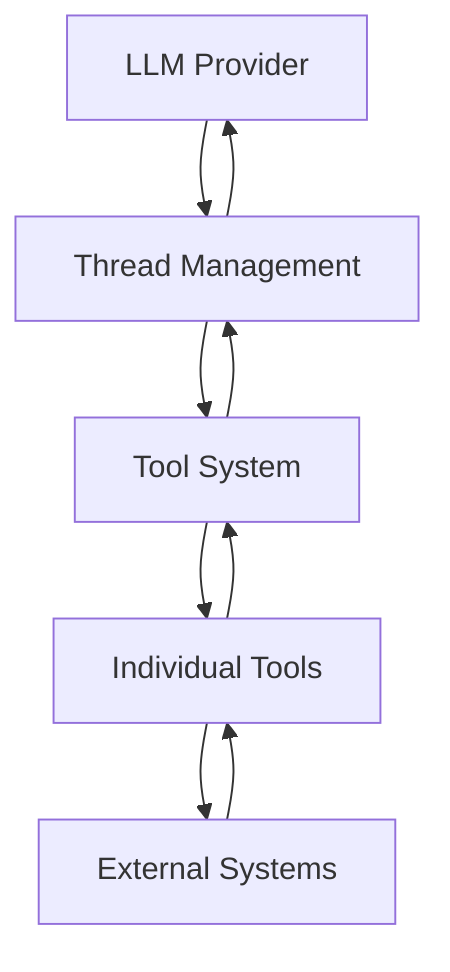
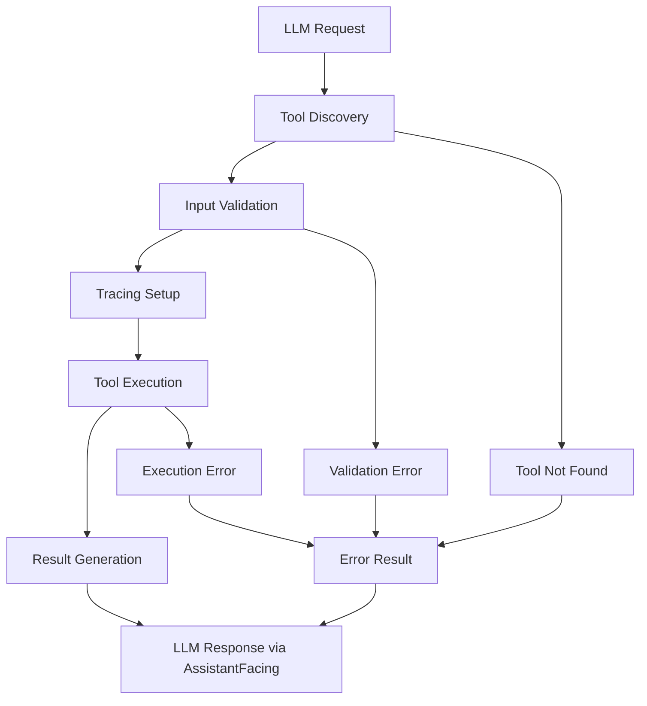

# Tool System Architecture

The Kodelet tool system enables AI agents to interact with external systems through a standardised interface. This document provides a comprehensive overview of the architecture, patterns, and implementation details.

## Table of Contents

- [Architecture Overview](#architecture-overview)
- [Core Interfaces](#core-interfaces)
- [Tool Execution Flow](#tool-execution-flow)
- [Available Tools](#available-tools)
- [Integration Patterns](#integration-patterns)
- [Error Handling](#error-handling)
- [Adding New Tools](#adding-new-tools)
- [Best Practices](#best-practices)

## Architecture Overview

The tool system follows a simple, straightforward architecture:



## Core Interfaces

### Tool Interface

The `Tool` interface defines the contract that all tools must implement:

```go
type Tool interface {
    GenerateSchema() *jsonschema.Schema    // JSON schema for LLM integration
    Name() string                          // Tool identifier
    Description() string                   // Tool description for LLM
    ValidateInput(state State, parameters string) error  // Input validation
    Execute(ctx context.Context, state State, parameters string) ToolResult  // Main execution
    TracingKVs(parameters string) ([]attribute.KeyValue, error)  // Telemetry support
}
```

### ToolResult Interface

The `ToolResult` interface standardises tool execution results:

```go
type ToolResult interface {
    AssistantFacing() string              // Human-readable result
    IsError() bool                        // Success/failure indicator
    GetError() string                     // Error message (deprecated)
    GetResult() string                    // Result content (deprecated)
    StructuredData() StructuredToolResult // Structured data for serialisation
}
```

### StructuredToolResult

The structured result format used for conversation persistence and telemetry:

```go
type StructuredToolResult struct {
    ToolName  string       `json:"toolName"`
    Success   bool         `json:"success"`
    Error     string       `json:"error,omitempty"`
    Metadata  ToolMetadata `json:"metadata,omitempty"`
    Timestamp time.Time    `json:"timestamp"`
}
```

### State Interface

The `State` interface provides tools with access to the execution context:

```go
type State interface {
    Tools() []Tool                        // Available tools
    Config() *config.Config               // Configuration access
    GetFileAccessTracker() *FileAccessTracker  // File access tracking
    GetBackgroundProcessManager() *BackgroundProcessManager  // Process management
    GetBrowserManager() *BrowserManager   // Browser session management
    GetMCPToolManager() *MCPToolManager   // MCP tool management
}
```

## Tool Execution Flow

The tool execution follows a well-defined pipeline:



### Execution Pipeline Implementation

```go
func RunTool(ctx context.Context, state tooltypes.State, toolName string, parameters string) tooltypes.ToolResult {
    // 1. Tool Discovery
    tool, err := findTool(toolName, state)
    if err != nil {
        return &ErrorToolResult{error: err.Error()}
    }

    // 2. Tracing Setup
    ctx, span := tracer.Start(ctx, fmt.Sprintf("tools.run_tool.%s", toolName))
    defer span.End()

    // 3. Input Validation
    if err := tool.ValidateInput(state, parameters); err != nil {
        return &ErrorToolResult{error: err.Error()}
    }

    // 4. Tool Execution
    result := tool.Execute(ctx, state, parameters)

    // 5. Telemetry Recording
    if result.IsError() {
        span.SetStatus(codes.Error, result.GetError())
    }

    return result
}
```

### Data Flow Clarification

It's important to understand that there are two separate data flows:

1. **LLM Response Flow**: Uses `result.AssistantFacing()` to send human-readable content back to the LLM
2. **Persistence Flow**: Uses `result.StructuredData()` for conversation storage and telemetry

The structured data is **not** used in the LLM response - it's stored separately for:
- Conversation persistence in the database
- Telemetry and tracing
- Debug information
- Tool execution metadata

## Available Tools

### File System Tools

| Tool | Description | Use Case |
|------|-------------|----------|
| `file_read` | Read file contents with line numbers | Code analysis, configuration review |
| `file_write` | Write/create files | Code generation, configuration updates |
| `file_edit` | Single edit operations | Targeted code changes |
| `file_multi_edit` | Multiple edit operations | Bulk code refactoring |

### Search Tools

| Tool | Description | Use Case |
|------|-------------|----------|
| `grep_tool` | Regex pattern search across files | Code search, pattern matching |
| `glob_tool` | File pattern matching and discovery | File system exploration |

### Execution Tools

| Tool | Description | Use Case |
|------|-------------|----------|
| `bash` | Execute shell commands with restrictions | System operations, build processes |
| `batch` | Execute multiple tools in parallel | Parallel operations, efficiency |
| `view_background_processes` | Monitor background processes | Process management, system monitoring |

### AI/Agent Tools

| Tool | Description | Use Case |
|------|-------------|----------|
| `thinking` | Internal reasoning and planning | Complex problem solving |
| `subagent` | Delegate tasks to sub-agents | Specialized operations |
| `image_recognition` | Process images with AI | Visual analysis, diagram understanding |

### Web Tools

| Tool | Description | Use Case |
|------|-------------|----------|
| `web_fetch` | Fetch web content with domain filtering | Documentation retrieval, API calls |

### Browser Tools (Optional)

| Tool | Description | Use Case |
|------|-------------|----------|
| `navigate` | Navigate to web pages | Web automation |
| `click` | Click page elements | Form interaction |
| `type` | Type text into forms | Data entry |
| `screenshot` | Capture screenshots | Visual verification |
| `get_page` | Extract page content | Content analysis |

### Productivity Tools

| Tool | Description | Use Case |
|------|-------------|----------|
| `todo_read` | Read todo lists | Task management |
| `todo_write` | Manage todo items | Planning, tracking |

### MCP Tools (Dynamic)

MCP (Model Context Protocol) tools are loaded dynamically from external servers and vary based on configuration. These tools provide language-specific code intelligence and integration with external systems. The available MCP tools depend on:

- Configured MCP servers in the environment
- Language servers and their capabilities
- External integrations enabled

Common examples include code navigation, symbol analysis, diagnostics, and external API integrations, but the specific tools available will vary by setup.

## Integration Patterns

### LLM Provider Integration

#### Anthropic Integration
```go
func ToAnthropicTools(tools []tooltypes.Tool) []anthropic.ToolUnionParam {
    anthropicTools := make([]anthropic.ToolUnionParam, len(tools))
    for i, tool := range tools {
        anthropicTools[i] = anthropic.ToolUnionParam{
            OfTool: &anthropic.ToolParam{
                Name:        tool.Name(),
                Description: tool.Description(),
                InputSchema: tool.GenerateSchema().Properties,
            },
        }
    }
    return anthropicTools
}
```

#### OpenAI Integration
```go
func ToOpenAITools(tools []tooltypes.Tool) []openai.Tool {
    openaiTools := make([]openai.Tool, len(tools))
    for i, tool := range tools {
        schema := tool.GenerateSchema()
        openaiTools[i] = openai.Tool{
            Type: "function",
            Function: &openai.FunctionDefinition{
                Name:        tool.Name(),
                Description: tool.Description(),
                Parameters:  schema,
            },
        }
    }
    return openaiTools
}
```

### Thread Integration Pattern

Both Anthropic and OpenAI threads follow the same pattern:

1. **Tool Registration**: Convert tools to provider-specific format
2. **Message Exchange**: Handle tool calls in conversation loop
3. **Tool Execution**: Execute tools via `tools.RunTool()`
4. **Result Handling**: Store structured results for persistence

```go
// Example from Anthropic thread
func (t *Thread) handleToolCall(ctx context.Context, toolCall anthropic.ToolUseBlock) (*anthropic.ToolResultBlock, error) {
    result := tools.RunTool(ctx, t.state, toolCall.Name, string(toolCall.Input))

    return &anthropic.ToolResultBlock{
        ToolUseID: toolCall.ID,
        Type:      "tool_result",
        Content:   result.AssistantFacing(),
        IsError:   result.IsError(),
    }, nil
}
```

## Error Handling

### Three-Layer Error Handling

#### 1. Validation Layer
- Input parameter validation
- Schema compliance checking
- Permission/restriction validation
- Early error detection

#### 2. Execution Layer
- Context cancellation support
- Timeout handling
- Resource management
- Graceful degradation

#### 3. Result Layer
- Structured error information
- Error vs success differentiation
- Rich error metadata
- User-friendly error messages

### Error Result Implementation

```go
type ErrorToolResult struct {
    error string
}

func (e *ErrorToolResult) AssistantFacing() string {
    return fmt.Sprintf("Error: %s", e.error)
}

func (e *ErrorToolResult) IsError() bool {
    return true
}

func (e *ErrorToolResult) StructuredData() StructuredToolResult {
    return StructuredToolResult{
        ToolName:  "error",
        Success:   false,
        Error:     e.error,
        Timestamp: time.Now(),
    }
}
```

## Adding New Tools

### Step 1: Implement Tool Interface

```go
type MyTool struct {
    // Tool configuration
}

func (t *MyTool) Name() string {
    return "my_tool"
}

func (t *MyTool) Description() string {
    return "Description of what this tool does"
}

func (t *MyTool) GenerateSchema() *jsonschema.Schema {
    return &jsonschema.Schema{
        Type: "object",
        Properties: map[string]*jsonschema.Schema{
            "parameter": {
                Type:        "string",
                Description: "Parameter description",
            },
        },
        Required: []string{"parameter"},
    }
}

func (t *MyTool) ValidateInput(state State, parameters string) error {
    // Validate input parameters
    return nil
}

func (t *MyTool) Execute(ctx context.Context, state State, parameters string) ToolResult {
    // Tool implementation
    return &MyToolResult{/* ... */}
}

func (t *MyTool) TracingKVs(parameters string) ([]attribute.KeyValue, error) {
    // Tracing attributes
    return []attribute.KeyValue{
        attribute.String("tool.name", t.Name()),
    }, nil
}
```

### Step 2: Implement Tool Result

```go
type MyToolResult struct {
    data   string
    error  string
}

func (r *MyToolResult) AssistantFacing() string {
    if r.error != "" {
        return fmt.Sprintf("Error: %s", r.error)
    }
    return r.data
}

func (r *MyToolResult) IsError() bool {
    return r.error != ""
}

func (r *MyToolResult) StructuredData() StructuredToolResult {
    return StructuredToolResult{
        ToolName:  "my_tool",
        Success:   !r.IsError(),
        Error:     r.error,
        Metadata:  &MyToolMetadata{Data: r.data},
        Timestamp: time.Now(),
    }
}
```

### Step 3: Implement Tool Metadata

```go
type MyToolMetadata struct {
    Data string `json:"data"`
}

func (m *MyToolMetadata) ToolType() string {
    return "my_tool"
}
```

### Step 4: Register Tool

Add to the appropriate tool array in `pkg/tools/tools.go`:

```go
var baseMainTools = []tooltypes.Tool{
    // ... existing tools
    &MyTool{},
}
```

### Step 5: Register Metadata Type

Add to metadata registry in `pkg/types/tools/structured_result.go`:

```go
var metadataTypeRegistry = map[string]reflect.Type{
    // ... existing types
    "my_tool": reflect.TypeOf(MyToolMetadata{}),
}
```

## Best Practices

### Tool Design Principles

1. **Single Responsibility**: Each tool should have a clear, focused purpose
2. **Stateless Execution**: Tools should not maintain state between calls
3. **Detailed Descriptions**: `Description()` must be comprehensive and detailed - see [Anthropic's tool use best practices](https://docs.anthropic.com/en/docs/agents-and-tools/tool-use/implement-tool-use#best-practices-for-tool-definitions)
4. **Fail Fast**: Validate inputs early and provide clear error messages
5. **Resource Management**: Clean up resources properly

### Validation Considerations

1. **Input Validation**: Always validate and sanitize inputs
2. **Permission Checks**: Respect file system and network restrictions
3. **Be Considerate with Context Window**: Limit output size to avoid LLM context rot
4. **Command Filtering**: Restrict dangerous shell commands
5. **Domain Filtering**: Limit web requests to safe domains

### Performance Considerations

1. **Parallel Execution**: Use `BatchTool` for independent operations
2. **Lazy Loading**: Load resources only when needed
3. **Timeout Management**: Set appropriate timeouts for operations

### Error Handling Best Practices

1. **Graceful Degradation**: Provide partial results when possible
2. **Context Preservation**: Include relevant context in error messages
3. **Retry Logic**: Implement retry for transient failures
4. **Logging**: Log errors for debugging and monitoring
5. **User-Friendly Messages**: Provide actionable error messages

### Testing Guidelines

1. **Unit Tests**: Test tool logic independently
2. **Integration Tests**: Test tool integration with external systems
3. **Error Cases**: Test error handling and edge cases
4. **Performance Tests**: Test with large inputs and timeouts
5. **Security Tests**: Test input validation and permission checks

This tool system provides a robust, extensible foundation for AI agent operations while maintaining security, observability, and reliability across different LLM providers and execution contexts.
